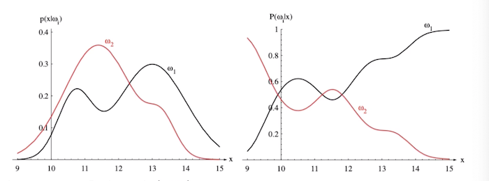
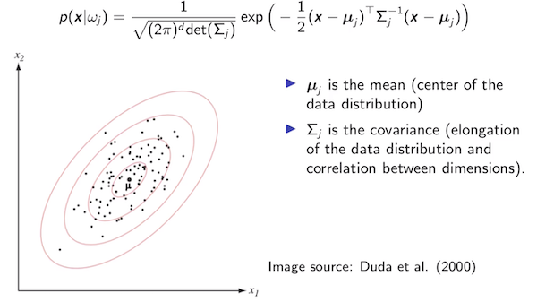

## Machine Learning I notes

### Lecture 0:

- textbook: Pattern Classification by David G. Stork, Peter E. Hart, and Richard O. Duda

### Lecture 1: Bayes Decision Theory

#### Introduction

- machine learning - designing algorithms that can convert data (observations) into predictive models
- why do we need ML? 
  - autonomous decision making for efficiency
    - modern economy involves good decision-making (recommendations, forecasting, quality control)
  - knowledge discovery - finding laws that explain empirical phenomena
- how do we build decision systems?
  - first generation: humans program the systems using if/else controls to replicate their decision process
  - problem: what if the user cannot translate their decision into an actual program? (e.g. objects in natural images)
  - second generation: collect a labeled dataset of examples and train a ML model to map each example to the correct class

#### Bayes Decision Theory

- a framework for building models that yields optimal classifiers (under the condition that we know everything about the data generation process - assumption that is rarely met)

- helps us understand the properties of the data distribution, prior probabilities of classes (more or less frequent), the criterion to optimize - all these will affect the classifier

- example from the book - fish on a conveyor belt with sensors that collect a set of measurements

- we would like to build a decision model to classify the fish

  - notation:
    - $w_1,w_2$ are classes
    - $x \in R^d$ is a vector of observations (e.g. $x_1$ is the length and $x_2$ is the weight)
  - probability laws:
    - $P(w_j)$ - the probability of class j
    - $p(x|w_j)$ - density function, e.g. Gaussian distribution of measurements for each class
    - $p(x)$ - marginalized density function of measurements (e.g. regardless of class)
    - we are interested in $P(w_j|x)$ - probability of being a certain class after observing x (the use case)

- **Bayes theorem: $$P(w_j|x)=\frac{p(x|w_j)\times P(w_j)}{p(x)}$$ or $$posterior=\frac{likelihood \times prior}{marginal\_likelihood}$$**

  - 
  - prior is the probability of the class before observing data, posterior of the class after observing data

  - the left side is the distribution of measurements for each class (e.g. class $w_2$ has a spread of 9 to 14, $w_1$ has two typical sizes)
  - applying Bayes theorem yields a distribution of classes given the measurements
  - the two curves sum to 1 (an observation must belong to 1 of 2 classes)
  - **based on the posterior, we can create an optimum decision policy: $\arg \max_j P(w_j|x)$ - decide in favor of the class that is most likely**

  - we can have alternate formulations of the decision that do not require Bayes' theorem
    - $\arg \max_j \frac{p(x|w_j)\times p(w_j)}{p(x)}$
    - $p(x)$ is positive and does not depend on j, so we can omit it
    - $\arg \max_j p(x|w_j)\times p(w_j)$
    - we also often see that $p(x|w_j)$ involves exponentials, so we can apply a log and remove the exp (applying a strictly monotonously increasing function to the argmax does not change it)
    - $\arg \max_j \log p(x|w_j)\times p(w_j)$
    - log of a product is the sum of logarithms
    - $\arg \max_j \log p(x|w_j)  + \log p(w_j) $
    - we need this formulation to simplify the derivations

-  specific case: data generated from a Gaussian distribution

   - 
   - the data distribution is Gaussian: $$p(x|w_j)=\frac{1}{\sqrt{(2\pi)^d\det(\Sigma_j)}}\exp(-\frac{1}{2}(x-\mu_j)^T\Sigma^{-1}_j(x-\mu_j))$$
     -  where $\mu$ is the mean (center) and $\Sigma$ describes the spread of the distribution and the correlation between dimensions
     -  exp of a negative term makes it go to 0 as the values move from the center
     -  the first term normalizes the distribution to 1

-  consider a classifier:

   -  assume that the two classes have the same covariance, $\Sigma_1=\Sigma_2$
   -  optimal classifier: $\arg \max_j \log p(x|w_j) + \log p(w_j)$ (the probability density for x according to class + the prior probability of a class $w_j$)
   -  due to the assumption above, we use a single matrix $\Sigma$
   -  apply the log to $p(x|w_j)$:
      -  $$log[p(x|w_j)]=\log \frac{1}{\sqrt{(2\pi)^d\det(\Sigma)}}+(-\frac{1}{2}(x-\mu_j)^T\Sigma^{-1}(x-\mu_j))$$
   -  the first term is constant, so we can remove it from the equation and our optimal classifier is equal to: $$\arg \max_j -\frac{1}{2}(x-\mu_j)^T\Sigma^{-1}(x-\mu_j) + \log P(w_j)$$
   -  we can simplify this to expand the quadratic form: $$\arg \max_j -\frac{1}{2}x^T\Sigma^{-1}x+x^T\Sigma^{-1}\mu_j-\frac{1}{2}\mu_j^T\Sigma^{-1}\mu_j + \log P(w_j)$$
   -  we have constant terms that don't depend on j, so we can remove them: $$\arg \max_j x^T\Sigma^{-1}\mu_j-\frac{1}{2}\mu_j^T\Sigma^{-1}\mu_j + \log P(w_j)$$
   -  **this is basically a linear model now**
      -  $v_j=x^T\Sigma^{-1}\mu_j$
      -  $b_j=-\frac{1}{2}\mu_j^T\Sigma^{-1}\mu_j + \log p(w_j)$
   -  *optimal boundary:* $\arg \max_j = v_j+b_j$

   -  practically, we apply these functions to the data and decide based on which value is higher
      -  the decision boundary is linear and oriented by mean and covariance
      -  changing the prior probabilities moves the decision boundary (due to adding $\log P(w_j)$)

-  another example: classifying non-numerical data (e.g. a spam classifier):

   -  represent a message as a collection of binary predicates testing for typical spam words and form a vector
   -  assume the data is binary $x \in {0,1}^d$
   -  generated according to a Bernoulli distribution $$P(x_i=0|w_j)=1-q_{ij}$$
   -  $$P(x_i=1|w_j)=q_{ij}$$
   -  the probability for one observation given a class $p(x_i|w_{ij}=q_{ij}x_i+(1-q_{ij})\cdot(1-x_i)$
   -  the probability for the entire multivariate observation (e.g. all the words): $\prod_{i=1}^d[q_{ij}x_i+(1-q_{ij})\cdot(1-x_i)]$
   -  how do we express the optimal decision boundary $\arg \max_j P(w_j|x)$?
      -  we know that the optimal classifier is $\arg \max_j \log[p(x|w_j)] + \log[P(w_j)]$
      -  but now we have a different distribution that generates the data
      -  we apply the log to $P(x|w_j)$, the log of a product becomes a sum of logs: $$\sum \log (q_{ij}x_i+(1-q_{ij})\cdot(1-x_i))$$
      -  there is no easy way to rewrite the sum of logs, but we can rewrite $q_{ij}x_i$ as $q_{ij}^{x_i}$ because it leads to the same result
      -  $=\arg \max_j \sum \log[q_{ij}^{x_i}(1-q_{ij})^{(1-x_i)}] + \log[P(w_j)]$
      -  $=\arg \max_j \sum x_i\log q_{ij}+(1-x_i)\log(1-q_{ij}) + \log[P(w_j)]$
      -  we also want to rewrite this in a **linear manner**:
         -  $a_{ij}=\log q_{ij}$
         -  $b_{ij}=\log (1-q_{ij})$
         -  $=\arg \max_j x^T a_j +(1-x)^Tb_j+ \log[P(w_j)]$
      -  *optimal boundary*: $=\arg \max_j x^T (a_j-b_j) + 1^Tb_j + \log[P(w_j)]$

-  cost minimizing: buying a car

   -  observe the car, assess the probabilities of defects given data: $P(\text{defect}|x)=0.1$ and $P(\text{no defect}|x)=0.9$
   -  the decision is to buy or not buy the car, we should evalute the cost of each scenario (e.g. buy or not buy given defect or no defect) and take the minimum cost action
   -  let $(\alpha_k)_k$ be the set of actions and the cost of a certain action is $\lambda$
   -  then the cost of taking a certain action is $$\lambda(\alpha_k|x)=\sum_{j=1}^C\lambda(\alpha_k|w_j)P(w_j|x)$$
      -  the cost of an action $alpha_k$ given the data x is the sum over all possible classes (e.g. defect or no defect) of the cost of this action given the class and the probability of the class given the data
   -  example values:
      	-  $\text{cost(buy|defect)}=100$
      	-  $\text{cost(buy|no defect)}=-20$
      	-  $\text{cost(not buy|defect)}=0$
      	-  $\text{cost(not buy|no defect)}=0$
   -  the optimal action will be to minimize costs, $\arg \min_k \lambda(\alpha_k|x)$
   -  $\lambda(\text{buy}|x)=100\times0.1+(-20)\times0.9=-8$
   -  $\lambda(\text{not buy}|x)=0\times0.1+0\times0.9=0$
   -  $\arg \min \{\text{buy}: -8, \text{not buy}: 0\} = \text{buy}$

-  special case of maximizing classification accuracy (e.g. cost minimization with a particular set of actions and a particular cost function is the problem of maximizing accuracy classification)

   -  define $\alpha_k$ to be the action of classifying as $w_k$
   -  $\lambda(\alpha_k|w_j) = -\delta_{jk}$ - cost of classifying something given the class is the Dirac function (indicator) that is equal to 1 if j = k and 0 otherwise (e.g. correct classification or not)
   -  $\arg \min_k \sum_j - \delta_{jk} \times P(w_j|x)$ - the sum - delta will only appear if j is equal to k 
   -  $=\arg \min -P(w_k|x)$ which is the same as $\arg \max P(w_k|x)$ (in the accuracy case, we want to maximize, not minimize)

-  cases above (fish classifier/general Gaussian classifier, non-numerical data, cost minimization) are optimal

-  but sometimes we need to know the expected error of the classifier (whether it is good enough even if it is optimal)

   -  $$\begin{equation} P(\text{Error}|x) = \begin{cases} P(w_1|x) & \text{decide } w_2\\ P(w_2|x) & \text{decide } w_1\\ \end{cases}      \end{equation}$$

- for the optimal Bayes classifier, this reduces to $P(\text{Error}|x)=min\{P(w_1|x), P(w_2|x)\}$

  - what is the general error $P(\text{Error})$? $$P(\text{Error})=\int_x P(\text{Error}|x) p(x) dx = \int_x min\{P(w_1|x), P(w_2|x)\} p(x) dx$$
  - this is the **Bayes error rate** - mostly it cannot be solved analytically due to the min function (has discontinuities)
  - but we can bound it analytically, e.g. for a binary classification: $P(w_2|x)=1-P(w_1|x)$
    	- we can simplify the integral to $$P(\text{Error})= \int_x \min\{P(w_1|x), 1-P(w_1|x)\} p(x) dx$$ $$\leq \int_x 0.5 p(x) dx = 0.5$$
    	- the min will always be smaller or equal to 0.5
  - another bound: 
    - recall that $P(w_j|x)p(x)=p(x|w_j)P(w_j)$ according to Bayes' theorem
    - rewrite the integral as $$P(\text{Error})= \int_x \min\{P(w_1|x)p(x), P(w_2|x)p(x)\} dx$$
    - then we substitute the values from Bayes' theorem:
    - $$=\int_x \min\{p(x|w_1)P(w_1), p(x|w_2)P(w_2)\} dx$$
    - $p(x|w_1)$ can also be replaced by the sum over both classes $$=(\sum_j \int_x p(x|w_j) dx)\cdot \min\{P(w_1),P(w_2)\} dx$$ $$=2\cdot \min\{P(w_1),P(w_2)\} dx$$ - 2 is due to the sum over two classes
    - this bound depends on the class priors (e.g. if one class is unlikely the error goes down)

- summary:

  - Bayes' Decision Theory allows us to build optimal machine learning classifiers (assuming we have full knowledge of class probabilities and data distributions)
  - BDT also highlights the effects of class priors, distribution parameters and cost function specification on the expected cost and the optimal decision function 

### Lecture 2: Parameter Estimation

- last lecture: $p(w_j|x)=\frac{P(x|w_j)p(w_j)}{p(x)}$ - Bayes theorem

  - we can infer posterior probabilities from it
  - if we know the data generating process $p(x|w)$ (e.g. Gaussian distribution), we can build a classifier: $\arg \max_j [p(w_j|x)] = \arg \max_j [\log p(x|w_j)+log p(w_j)]$

- can we assume that we know the data densities $p(\pmb{x}|w)$? or learn from data?

- idea: build a histogram in a discretized input space (e.g. count observations in each bin) and normalize it

  - problem: a lot of dimensions - $s^d$ (curse of dimensionality)
  - if there are finite observations, $p(x)=0$ which will break the classifier

- model-based approach:

  - assume a parametric form for $p(x|w)$, e.g. $\mathcal{N}(\mu_j,\Sigma_j)$
  - we estimate the parameters of the distribution that give a better fit
  - an advantage: we have less values to estimate
  - a disadvantage: we assume a distribution and the assumption might be wrong
    - however, Central Limit Theorem says that a sum of non-Gaussian distributions will approach the bell curve

- goal: we are given a set of density functions, e.g. Gaussian ${p(x|\theta), \theta \in \Theta}$, where theta is the parameter vector that we want to find 

- assume a dataset $D=(x_1...x_N)$

- assume that each example is generated independently and drawn from the same dataset $p(x|\theta)$ - in this case, the entire probability of the dataset given the parameters will be: $$p(D|\theta)=\prod_{k=1}^N p(x_k|\theta)$$

  - this is the likelihood of parameters theta with respect to dataset D, e.g. $p(D|\theta)=L(\theta|D)$

- **best parameters are given by $\hat\theta=\arg\max_\theta p(D|\theta)$ - maximizing the likelihood **

- example:

  - assume data density is Gaussian and we can get the joint density via a product (independence assumption)
  - how to find $\theta$ to maximize likelihood $p(D|\theta)$?
  - calculus recap:
    - if we have a function $f(x)$ and we would like to find $\arg\max f(x)$, we don't have to look at all the values - we can require the function to be concave (pointing up) and continuously differentiable
    - then the maximum will be where the gradient (vector derivative) is 0:
      $$\nabla_\theta f(\theta) = [\partial f/\partial \theta_1 .... \partial f/\partial \theta_h] = 0$$
   - if we look at the Gaussian distribution, it is not concave - but we can transform it to be by applying a logarithm (log of products becomes a sum of the logs and the exponential disappears) - *log likelihood*
     -  then we can find the best parameters by solving $\nabla_\theta log P(D|\theta)=\sum_{k=1}^N[-0.5 \log (2\pi)-0.5(x_k-\theta)^2]$
      -  gradient of a sum is a sum of gradients:
         $$\nabla_\theta log P(D|\theta)=\sum_{k=1}^N\nabla_\theta [-0.5 \log(2\pi)]- \nabla_\theta [-0.5(x_k-\theta)^2]$$
      -  the first gradient is constant so = 0
         $$=\sum_{k=1}^N \nabla_\theta [-0.5(x_k-\theta)^2]$$
      -  apply chain rule for the second half
         $$=\sum_{k=1}^N -(x_k-\theta)\cdot - 1$$
          $$\sum_{k=1}^N -(x_k-\theta)\cdot - 1=0$$
          $$\sum_{k=1}^N  x_k-\theta=0$$
          $$\sum_{k=1}^N x_k = \sum_{k=1}^N \theta$$
          $$\sum_{k=1}^N x_k = N\cdot\theta$$ since theta doesn't depend on k
          $$\hat\theta=\frac{1}{N}\sum_{k=1}^Nx_k$$
      -  **optimal parameter is the one where the mean corresponds to the empirical mean of the data ($\theta=\bar x$)** 

 -  generalize to the multivariate case:

    -  multivariate Gaussian: $$\log p(D|\theta) = \sum_{k=1}^N -0.5 \log[(2\pi)^d det(\Sigma)]-0.5(x_k-\mu)^T\Sigma^{-1}(x_k-\mu)$$
     -  assuming sigma is fixed, what is the optimal mean vector?
     -  in a Gaussian distribution, the covariance matrix is positive definite ($\Sigma$, but also $\Sigma^{-1}$)
     -  if a Hessian (second order partial derivatives) of a function is negative definite, then the function is concave 
        $$\frac{\partial^2}{d\mu} -0.5(x_k-\mu)^T\Sigma^{-1}(x_k-\mu)=-\Sigma^{-1}$$ 
     -  so the result is negative definite, just like we need for concavity (and the sum of concave functions is also a concave function)
     -  therefore, we can find the maximum likelihood by calculating the gradient of $\log p(D|\mu)$: $$\nabla_\theta log P(D|\mu)=\sum_{k=1}^N 0 + \Sigma^{-1}(x_k-\mu)$$
        - reference for gradient/Hessian - [matrix cookbook](https://www.math.uwaterloo.ca/~hwolkowi/matrixcookbook.pdf)
          $$\sum_{k=1}^N 0 + \Sigma^{-1}(x_k-\mu)=0$$
           $$\sum_{k=1}^N \Sigma^{-1}x_k=\sum_{k=1}^N \Sigma^{-1}\mu$$
          mu does not depend on k, so we can replace is with a factor
          $$\sum_{k=1}^N \Sigma^{-1}x_k= N\cdot\Sigma^{-1}\mu$$
          multiply by sigma and 1/N:
          $$\frac{1}{N}\cdot \sum_{k=1}^N \Sigma\Sigma^{-1}x_k=\frac{1}{N} N\cdot\Sigma^{-1}\mu$$
          $$\frac{1}{N}\cdot \sum_{k=1}^N I x_k=I\mu$$
          $$\frac{1}{N}\cdot \sum_{k=1}^N x_k=\mu$$
          same result as before: optimal (maximum likelihood) parameter for mu is the empirical mean of the data

- **building a classifier with ML**

  - we don't have the knowledge of the full data generating process
  - we consider a labeled dataset containing 2 examples for class 1 and 4 examples for class 2 (drawn from classes $w_1$ and $w_2$ respectively)
    - we know the family of the functions but not the parameters $\mu$
    - we also know classes occur with equal probabilities
  - given:
    - $p(w_1)=0.5$, $p(w_2)=0.5$
    - $p(x=k|\theta_1)=(1-\theta_1)^k \theta_1$
    - $p(x=k|\theta_2)=(1-\theta_2)^k \theta_2$
    - $D_1 = {0,2}$
    - $D_2 = {0,2,0,1}$
  - we want to maximize $p(D_1|\theta_1)$ - the likelihood of our parameters:
    - we compute the product of $p(x=k|\theta_1)$ for all the observed values of x
    - for $D_1 = 0, 2$, we get $$p(D_1|\theta_1)=\theta_1^2\cdot(1-\theta_1)^2$$
    - this function is not convex, but we can make it convex by applying a logarithm: $$\log p(D_1|\theta_1)=2\log\theta_1+2\log(1-\theta_1)$$
    - since it is convex, we can find the optimal parameters by looking at the gradient of the log likelihood: $$\nabla_{\theta} \log p(D_1|\theta_1) = \frac{2}{\theta_1}-\frac{2}{1-\theta_1}$$, $$\frac{2}{\theta_1}-\frac{2}{1-\theta_1} = 0$$ ,$$\frac{2}{\theta_1}=\frac{2}{1-\theta_1}$$m $$\theta_1 = 1-\theta_1$$, $$\theta_1 = \frac{1}{2}$$
  - we can do the same for $\theta_2$:
    - for $D_2 = 0, 2, 0, 1$, we get $$p(D_2|\theta_2)=\theta_2\cdot(1-\theta)^2\cdot \theta_2\cdot\theta_2\cdot(1-\theta_2)\theta_2$$ $$=(1-\theta_2)^3\theta_2^4$$
    - $\log p(D_2|\theta_2)=3\log(1-\theta_2)+4\log\theta_2$
    - $\nabla_{\theta} 3\log(1-\theta_2)+4\log\theta_2=-\frac{3}{1-\theta_2}+\frac{4}{\theta_2}$
    - $3\theta_2=4(1-\theta_2)$
    - $3\theta_2=4-4\theta_2$
    - $\theta_2=4/7\approx0.57$

- we can apply Bayesian decision theory: in BDT, we predict the class using $\arg \max_j p(w_j|x)$ or $\arg \max_j p(x|w_j)\cdotp(w_j)$ (p(x) doesn't depend on j and doesn't affect the argmax)

  - for $w_1$, we have $p(x|w_1)\cdotp(w_1)$
  - assume that we have an incoming datapoint x = 1
  - $p(x=1|w_1)\cdotp(w_1)=(1-\theta_1)\theta_1\cdot p(w_1)$
  - now we will use our optimal theta obtained above, 1/2
  - $=(1-0.5)\cdot0.5\cdot p(w_1)$ and we know that $p(w_1)=0.5$ as given
  - $= 0.125$
  - same calculation for $w_1$: $(1-\theta_2)\theta_2\cdot p(w_2)=(1-0.57)\cdot0.57\cdot0.5=0.123$
  - the likelihood is higher for $w_1$

- **Bayesian approach to estimating parameters:**

  - instead of maximizing the likelihood like before ($\hat\theta=\arg\max_j p(D|\theta))$, we can build a distribution over this parameter
  - $p(\theta|D)=\frac{p(D|\theta)p(\theta)}{p(D)}$ - this distribution will describe the probability of our parameters given the data
  - we will need $p(\theta)$, which is the **prior** on the parameters (can include prior knowledge or be uniform)
  - how to make a classifier out of it?
  - In maximum likelihood classification, we try to find $p(w_j|x)=\frac{p(x|w_j,\hat\theta_j)p(w_j)}{\sum_jp(x|w_j,\hat\theta_j)p(w_j)}$ (we use our optimal theta obtained by maximizing the log likelihood of the model parameters $p(x|\theta)$ to find the *posterior*, so the likelihood of the class given data - **we have an intermediate step where we optimize the parameters**)
  - in Bayesian classifiers, we bypass the intermediate step and condition **directly on the data**: $p(w_j|x,D)=\frac{p(x|w_j,D)p(w_j)}{\sum_jp(x|w_j,D)p(w_j)}$ - we originally have $p(w_j|D)$, but we can assume that class priors are set and don't depend on the data

- to connect the two approaches, we can express the term $p(x|w_j,D)$ in terms of the parameters:

  - $p(x|w_j,D)=\int p(x|\theta_i,w_i,D_i)p(\theta_i|w_i,D_i)d\theta_i$ , where D are the previous datapoints given
  - $=\int p(x|\theta_i)p(\theta_i|D_i)d\theta_i$ - integrating the joint distribution x and theta over theta to get rid of theta
    - *we don't keep the $w_i$ dependence because it's implicit in $D_i$ and we assume that x is generated independently, so $p(x|D) = p(x)$*
  - where $p(\theta_i|D_i)=\frac{p(D_i|\theta_i)\cdot p(\theta_i)}{\int p(D_i|\theta_i)p(\theta_i)d\theta_i}$
  - pipeline: generate $p(\theta|D)$, then compute the integral to get $p(x|w,D)$ and then compute the class posterior/decision function $p(w|x,D)$

- **building a classifier with Bayes**

  - again, we don't have the knowledge of the full data generating process
  - we consider a labeled dataset containing 2 examples for class 1 and 4 examples for class 2 (drawn from classes $w_1$ and $w_2$ respectively) - same observed values as in building the ML classifier above ($D_1 = 0,2$ and $D_2=0,2,0,1$)
  - $p(\theta_1|D_1)=\frac{p(D_1|\theta_1)\cdot p(\theta_1)}{\int p(D_1|\theta_1)p(\theta_1)d\theta_i}$
  - we set the priors $p(\theta_1)=\mathcal{U}(0,1)$ - uniform distribution between 0 and 1
  - using previous computations,
    - $\frac{\theta_1^2*(1-\theta_1)^2*1}{\int_0^1\theta_1^2(1-\theta_1)^2*1d\theta_1}$
    - the integral evaluates to 1/30 => $30\cdot\theta_1^2(1-\theta_1)^2$
    - if we plot the function, it looks like a bell shape between 0 and 1 and reaches the optimum at 0.5
    - compared to ML, we don't get a fixed estimate but a probability distribution around 0.5
  - we can do the same computation with class 2, resulting in $280\cdot\theta_2^4\cdot(1-\theta_2)^3$
  - the shape is a narrower bell shape between 0 and 1, centered closer to 4/7

- again, we can try to classify a new datapoint with this:

  - $x = 1$, compute $p(x|w_1,D_1)=\int_0^1p(x|\theta_1)\cdot p(\theta_1|D_1)d\theta_1=\int_0^1\theta_1^3(1-\theta_1)^3\cdot30=\frac{3}{14}=0.214$
  - same with the other class:
    - $p(x|w_2,D_2)=\int_0^1p(x|\theta_2)\cdot p(\theta_2|D_2)d\theta_2=\int_0^1\theta_2^5(1-\theta_2)^4\cdot280=\frac{2}{9}=0.22$
  - to compute the decision, we calculate $\arg \max_j  p(x|w_j,D_j)\cdot p(w_j)$ (as before, argmax of the numerator of the class posterior because the denominator is constant)
    - for class 1, it's equal to $0.214*0.5$ and for class 2, $0.222*0.5$, so we decide in favor of class 2

- we have contradictory results! MLE tells us to choose class 1, while Bayesian estimation tells us to estimate class 2

  - in Bayesian estimation, we introduce priors - Bayes classifiers are influenced by priors and less by data
  - Bayes classifiers prefer classes supported by more data

- **estimating Gaussian parameters with ML and Bayesian estimation**

  - consider a data density $p(x|\mu)=\mathcal{N}(\mu,\sigma^2)$ with an unknown mean $\mu$ (assume fixed variance)
  - ML approach: $\hat\mu=\frac{1}{n}\sum_{i=1}^Nx_i$ (empirical mean, calculated above)
  - Bayesian approach: assume some prior distribution over the mean $p(\mu)=\mathcal{N}(\mu_0,\sigma^2_0)$
    - using Bayes theorem, we get $p(\mu|D)=\frac{p(D|\mu)p(\mu)}{p(D)}$ 
    - assume all datapoints are independent, $p(D|\mu)$ is equal to the product of $p(x_k|\mu)\cdotp(\mu)$ over all k
      - $p(\mu|D)=\alpha\prod_{k=1}^np(x_k|u)p(u)$
    - we can expand this using the formula for the Gaussian distribution, e.g. 
    - $$p(\mu|D)=\alpha\prod_{k=1}^n\frac{1}{\sqrt{2\pi\sigma}}\exp[-0.5(\frac{x_k-\mu}{\sigma})^2] \frac{1}{\sqrt{2\pi\sigma}}\exp[-0.5(\frac{\mu-\mu_0}{\sigma})^2]$$
    - (both the probability of x given the mean and the prior probability of the mean are Gaussian)
  - solving this will give us a new Gaussian distribution with the required parameters
    - $\mu_n = \frac{\sigma_n^2}{\sigma^2_n/n}\hat\mu_0$
    - $\sigma^2_n=(\frac{1}{\sigma^2/n}+\frac{1}{\sigma_0^2})^{-1}$
    - the mean estimate will be pulled towards the prior if the n is small (e.g. the fraction will move towards 1)
    - the mean estimate has a variance term $\sigma^2_n$ which can help us estimate the confidence
    - more observed data will bring the Bayes posterior model towards the ML estimator

- **summary**:

  - we typically don't know parameters of distributions that generate the data
  - we have two approaches of learning the parameters of these distributions, maximum likelihood estimation and Bayesian inference
  - Bayesian inference is more difficult, since it requires integration, but it incorporates some interesting functionalities (we can include priors informed by previous knowledge and we can obtain confidence estimates on our results)

  ​	

   

 