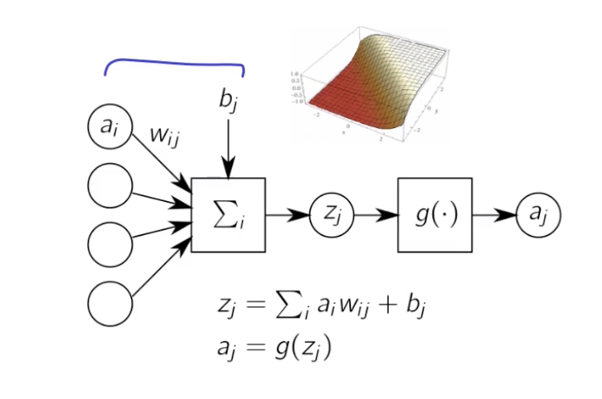
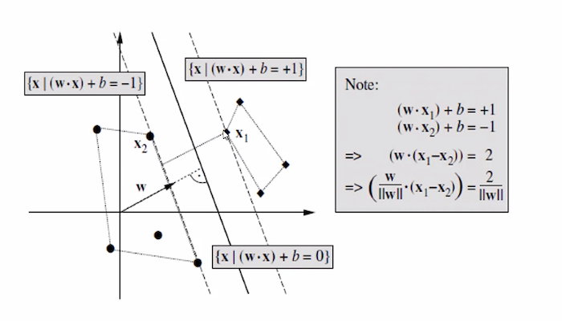

# Machine Learning I 

- Textbook: Pattern Classification by David G. Stork, Peter E. Hart, and Richard O. Duda

## Lecture 1: Bayes Decision Theory

#### Introduction

- machine learning - designing algorithms that can convert data (observations) into predictive models
- why do we need ML? 
  - autonomous decision making for efficiency
    - modern economy involves good decision-making (recommendations, forecasting, quality control)
  - knowledge discovery - finding laws that explain empirical phenomena
- how do we build decision systems?
  - first generation: humans program the systems using if/else controls to replicate their decision process
  - problem: what if the user cannot translate their decision into an actual program? (e.g. objects in natural images)
  - second generation: collect a labeled dataset of examples and train a ML model to map each example to the correct class

#### Bayes Decision Theory

- a framework for building models that yields optimal classifiers (under the condition that we know everything about the data generation process - assumption that is rarely met)
- helps us understand the properties of the data distribution, prior probabilities of classes (more or less frequent), the criterion to optimize - all these will affect the classifier
- example from the book - fish on a conveyor belt with sensors that collect a set of measurements
- we would like to build a decision model to classify the fish

  - notation:
    - $w_1,w_2$ are classes
    - $x \in R^d$ is a vector of observations (e.g. $x_1$ is the length and $x_2$ is the weight)
  - probability laws:
    - $P(w_j)$ - the probability of class j
    - $p(x|w_j)$ - density function, e.g. Gaussian distribution of measurements for each class
    - $p(x)$ - marginalized density function of measurements (e.g. regardless of class)
    - we are interested in $P(w_j|x)$ - probability of being a certain class after observing x (the use case)
- **Bayes theorem: $$P(w_j|x)=\frac{p(x|w_j)\times P(w_j)}{p(x)}$$ or $$posterior=\frac{likelihood \times prior}{marginal\_likelihood}$$**
  - 
  - prior is the probability of the class before observing data, posterior of the class after observing data
  
  - the left side is the distribution of measurements for each class (e.g. class $w_2$ has a spread of 9 to 14, $w_1$ has two typical sizes)
  - applying Bayes theorem yields a distribution of classes given the measurements
  - the two curves sum to 1 (an observation must belong to 1 of 2 classes)
  - **based on the posterior, we can create an optimum decision policy: $\arg \max_j P(w_j|x)$ - decide in favor of the class that is most likely**
  
  - we can have alternate formulations of the decision that do not require Bayes' theorem
    - $\arg \max_j \frac{p(x|w_j)\times p(w_j)}{p(x)}$
    - $p(x)$ is positive and does not depend on j, so we can omit it
    - $\arg \max_j p(x|w_j)\times p(w_j)$
    - we also often see that $p(x|w_j)$ involves exponentials, so we can apply a log and remove the exp (applying a strictly monotonously increasing function to the argmax does not change it)
    - $\arg \max_j \log p(x|w_j)\times p(w_j)$
    - log of a product is the sum of logarithms
    - $\arg \max_j \log p(x|w_j)  + \log p(w_j) $
    - we need this formulation to simplify the derivations
-  specific case: data generated from a Gaussian distribution

   - 
   - the data distribution is Gaussian: $$p(x|w_j)=\frac{1}{\sqrt{(2\pi)^d\det(\Sigma_j)}}\exp(-\frac{1}{2}(x-\mu_j)^T\Sigma^{-1}_j(x-\mu_j))$$
     -  where $\mu$ is the mean (center) and $\Sigma$ describes the spread of the distribution and the correlation between dimensions
     -  exp of a negative term makes it go to 0 as the values move from the center
     -  the first term normalizes the distribution to 1
-  consider a classifier:

   -  assume that the two classes have the same covariance, $\Sigma_1=\Sigma_2$
   -  optimal classifier: $\arg \max_j \log p(x|w_j) + \log p(w_j)$ (the probability density for x according to class + the prior probability of a class $w_j$)
   -  due to the assumption above, we use a single matrix $\Sigma$
   -  apply the log to $p(x|w_j)$:
      -  $$log[p(x|w_j)]=\log \frac{1}{\sqrt{(2\pi)^d\det(\Sigma)}}+(-\frac{1}{2}(x-\mu_j)^T\Sigma^{-1}(x-\mu_j))$$
   -  the first term is constant, so we can remove it from the equation and our optimal classifier is equal to: $$\arg \max_j -\frac{1}{2}(x-\mu_j)^T\Sigma^{-1}(x-\mu_j) + \log P(w_j)$$
   -  we can simplify this to expand the quadratic form: $$\arg \max_j -\frac{1}{2}x^T\Sigma^{-1}x+x^T\Sigma^{-1}\mu_j-\frac{1}{2}\mu_j^T\Sigma^{-1}\mu_j + \log P(w_j)$$
   -  we have constant terms that don't depend on j, so we can remove them: $$\arg \max_j x^T\Sigma^{-1}\mu_j-\frac{1}{2}\mu_j^T\Sigma^{-1}\mu_j + \log P(w_j)$$
   -  **this is basically a linear model now**
      -  $v_j=x^T\Sigma^{-1}\mu_j$
      -  $b_j=-\frac{1}{2}\mu_j^T\Sigma^{-1}\mu_j + \log p(w_j)$
   -  *optimal boundary:* $\arg \max_j = v_j+b_j$

   -  practically, we apply these functions to the data and decide based on which value is higher
      -  the decision boundary is linear and oriented by mean and covariance
      -  changing the prior probabilities moves the decision boundary (due to adding $\log P(w_j)$)
- another example: classifying non-numerical data (e.g. a spam classifier):

   -  represent a message as a collection of binary predicates testing for typical spam words and form a vector
   -  assume the data is binary $x \in {0,1}^d$
   -  generated according to a Bernoulli distribution $$P(x_i=0|w_j)=1-q_{ij}$$
   -  $$P(x_i=1|w_j)=q_{ij}$$
   -  the probability for one observation given a class $p(x_i|w_{ij}=q_{ij}x_i+(1-q_{ij})\cdot(1-x_i)$
   -  the probability for the entire multivariate observation (e.g. all the words): $\prod_{i=1}^d[q_{ij}x_i+(1-q_{ij})\cdot(1-x_i)]$
   -  how do we express the optimal decision boundary $\arg \max_j P(w_j|x)$?
      -  we know that the optimal classifier is $\arg \max_j \log[p(x|w_j)] + \log[P(w_j)]$
      -  but now we have a different distribution that generates the data
      -  we apply the log to $P(x|w_j)$, the log of a product becomes a sum of logs: $$\sum \log (q_{ij}x_i+(1-q_{ij})\cdot(1-x_i))$$
      -  there is no easy way to rewrite the sum of logs, but we can rewrite $q_{ij}x_i$ as $q_{ij}^{x_i}$ because it leads to the same result
      -  $=\arg \max_j \sum \log[q_{ij}^{x_i}(1-q_{ij})^{(1-x_i)}] + \log[P(w_j)]$
      -  $=\arg \max_j \sum x_i\log q_{ij}+(1-x_i)\log(1-q_{ij}) + \log[P(w_j)]$
      -  we also want to rewrite this in a **linear manner**:
         -  $a_{ij}=\log q_{ij}$
         -  $b_{ij}=\log (1-q_{ij})$
         -  $=\arg \max_j x^T a_j +(1-x)^Tb_j+ \log[P(w_j)]$
      -  *optimal boundary*: $=\arg \max_j x^T (a_j-b_j) + 1^Tb_j + \log[P(w_j)]$

#### Cost minimization

- cost minimizing: buying a car
   -  observe the car, assess the probabilities of defects given data: $P(\text{defect}|x)=0.1$ and $P(\text{no defect}|x)=0.9$
   -  the decision is to buy or not buy the car, we should evalute the cost of each scenario (e.g. buy or not buy given defect or no defect) and take the minimum cost action
   -  let $(\alpha_k)_k$ be the set of actions and the cost of a certain action is $\lambda$
   -  then the cost of taking a certain action is $$\lambda(\alpha_k|x)=\sum_{j=1}^C\lambda(\alpha_k|w_j)P(w_j|x)$$
      -  the cost of an action $alpha_k$ given the data x is the sum over all possible classes (e.g. defect or no defect) of the cost of this action given the class and the probability of the class given the data
   -  example values:
      	-  $\text{cost(buy|defect)}=100$
      	-  $\text{cost(buy|no defect)}=-20$
      	-  $\text{cost(not buy|defect)}=0$
      	-  $\text{cost(not buy|no defect)}=0$
   -  the optimal action will be to minimize costs, $\arg \min_k \lambda(\alpha_k|x)$
   -  $\lambda(\text{buy}|x)=100\times0.1+(-20)\times0.9=-8$
   -  $\lambda(\text{not buy}|x)=0\times0.1+0\times0.9=0$
   -  $\arg \min \{\text{buy}: -8, \text{not buy}: 0\} = \text{buy}$
- special case of maximizing classification accuracy (e.g. cost minimization with a particular set of actions and a particular cost function is the problem of maximizing accuracy classification)

   -  define $\alpha_k$ to be the action of classifying as $w_k$
   -  $\lambda(\alpha_k|w_j) = -\delta_{jk}$ - cost of classifying something given the class is the Dirac function (indicator) that is equal to 1 if j = k and 0 otherwise (e.g. correct classification or not)
   -  $\arg \min_k \sum_j - \delta_{jk} \times P(w_j|x)$ - the sum - delta will only appear if j is equal to k 
   -  $=\arg \min -P(w_k|x)$ which is the same as $\arg \max P(w_k|x)$ (in the accuracy case, we want to maximize, not minimize)

#### Expected error

- cases above (fish classifier/general Gaussian classifier, non-numerical data, cost minimization) are optimal
- but sometimes we need to know the expected error of the classifier (whether it is good enough even if it is optimal)

   -  $$\begin{equation} P(\text{Error}|x) = \begin{cases} P(w_1|x) & \text{decide } w_2\\ P(w_2|x) & \text{decide } w_1\\ \end{cases}      \end{equation}$$
- for the optimal Bayes classifier, this reduces to $P(\text{Error}|x)=min\{P(w_1|x), P(w_2|x)\}$

  - what is the general error $P(\text{Error})$? $$P(\text{Error})=\int_x P(\text{Error}|x) p(x) dx = \int_x min\{P(w_1|x), P(w_2|x)\} p(x) dx$$
  - this is the **Bayes error rate** - mostly it cannot be solved analytically due to the min function (has discontinuities)
  - but we can bound it analytically, e.g. for a binary classification: $P(w_2|x)=1-P(w_1|x)$
    	- we can simplify the integral to $$P(\text{Error})= \int_x \min\{P(w_1|x), 1-P(w_1|x)\} p(x) dx$$ $$\leq \int_x 0.5 p(x) dx = 0.5$$
    	- the min will always be smaller or equal to 0.5
  - another bound: 
    - recall that $P(w_j|x)p(x)=p(x|w_j)P(w_j)$ according to Bayes' theorem
    - rewrite the integral as $$P(\text{Error})= \int_x \min\{P(w_1|x)p(x), P(w_2|x)p(x)\} dx$$
    - then we substitute the values from Bayes' theorem:
    - $$=\int_x \min\{p(x|w_1)P(w_1), p(x|w_2)P(w_2)\} dx$$
    - $p(x|w_1)$ can also be replaced by the sum over both classes $$=(\sum_j \int_x p(x|w_j) dx)\cdot \min\{P(w_1),P(w_2)\} dx$$ $$=2\cdot \min\{P(w_1),P(w_2)\} dx$$ - 2 is due to the sum over two classes
    - this bound depends on the class priors (e.g. if one class is unlikely the error goes down)

#### Summary

- Bayes' Decision Theory allows us to build optimal machine learning classifiers (assuming we have full knowledge of class probabilities and data distributions)
- BDT also highlights the effects of class priors, distribution parameters and cost function specification on the expected cost and the optimal decision function 

## Lecture 2: Parameter Estimation

- last lecture: $p(w_j|x)=\frac{P(x|w_j)p(w_j)}{p(x)}$ - Bayes theorem

  - we can infer posterior probabilities from it
  - if we know the data generating process $p(x|w)$ (e.g. Gaussian distribution), we can build a classifier: $\arg \max_j [p(w_j|x)] = \arg \max_j [\log p(x|w_j)+log p(w_j)]$
- can we assume that we know the data densities $p(\pmb{x}|w)$? or learn from data?
- idea: build a histogram in a discretized input space (e.g. count observations in each bin) and normalize it

  - problem: a lot of dimensions - $s^d$ (curse of dimensionality)
  - if there are finite observations, $p(x)=0$ which will break the classifier

#### Model-based approach (MLE)

- assume a parametric form for $p(x|w)$, e.g. $\mathcal{N}(\mu_j,\Sigma_j)$
- we estimate the parameters of the distribution that give a better fit
- an advantage: we have less values to estimate
- a disadvantage: we assume a distribution and the assumption might be wrong
  - however, Central Limit Theorem says that a sum of non-Gaussian distributions will approach the bell curve

- goal: we are given a set of density functions, e.g. Gaussian ${p(x|\theta), \theta \in \Theta}$, where theta is the parameter vector that we want to find 
- assume a dataset $D=(x_1...x_N)$
- assume that each example is generated independently and drawn from the same dataset $p(x|\theta)$ - in this case, the entire probability of the dataset given the parameters will be: $$p(D|\theta)=\prod_{k=1}^N p(x_k|\theta)$$

  - this is the likelihood of parameters theta with respect to dataset D, e.g. $p(D|\theta)=L(\theta|D)$
- **best parameters are given by $\hat\theta=\arg\max_\theta p(D|\theta)$ - maximizing the likelihood **
- example:

  - assume data density is Gaussian and we can get the joint density via a product (independence assumption)
  - how to find $\theta$ to maximize likelihood $p(D|\theta)$?
  - calculus recap:
    - if we have a function $f(x)$ and we would like to find $\arg \max f(x)$, we don't have to look at all the values - we can require the function to be concave (pointing up) and continuously differentiable
    - then the maximum will be where the gradient (vector derivative) is 0:
      $$\nabla_\theta f(\theta) = [\partial f/\partial \theta_1 .... \partial f/\partial \theta_h] = 0$$
   - if we look at the Gaussian distribution, it is not concave - but we can transform it to be by applying a logarithm (log of products becomes a sum of the logs and the exponential disappears) - *log likelihood*
     -  then we can find the best parameters by solving $\nabla_\theta log P(D|\theta)=\sum_{k=1}^N[-0.5 \log (2\pi)-0.5(x_k-\theta)^2]$
      -  gradient of a sum is a sum of gradients:
         $$\nabla_\theta log P(D|\theta)=\sum_{k=1}^N\nabla_\theta [-0.5 \log(2\pi)]- \nabla_\theta [-0.5(x_k-\theta)^2]$$
      -  the first gradient is constant so = 0
         $$=\sum_{k=1}^N \nabla_\theta [-0.5(x_k-\theta)^2]$$
      -  apply chain rule for the second half
         $$=\sum_{k=1}^N -(x_k-\theta)\cdot - 1$$
          $$\sum_{k=1}^N -(x_k-\theta)\cdot - 1=0$$
          $$\sum_{k=1}^N  x_k-\theta=0$$
          $$\sum_{k=1}^N x_k = \sum_{k=1}^N \theta$$
          $$\sum_{k=1}^N x_k = N\cdot\theta$$ since theta doesn't depend on k
          $$\hat\theta=\frac{1}{N}\sum_{k=1}^Nx_k$$
      -  **optimal parameter is the one where the mean corresponds to the empirical mean of the data ($\theta=\bar x$)** 
 - generalize to the multivariate case:

    -  multivariate Gaussian: $$\log p(D|\theta) = \sum_{k=1}^N -0.5 \log[(2\pi)^d det(\Sigma)]-0.5(x_k-\mu)^T\Sigma^{-1}(x_k-\mu)$$
     -  assuming sigma is fixed, what is the optimal mean vector?
     -  in a Gaussian distribution, the covariance matrix is positive definite ($\Sigma$, but also $\Sigma^{-1}$)
     -  if a Hessian (second order partial derivatives) of a function is negative definite, then the function is concave 
        $$\frac{\partial^2}{d\mu} -0.5(x_k-\mu)^T\Sigma^{-1}(x_k-\mu)=-\Sigma^{-1}$$ 
     -  so the result is negative definite, just like we need for concavity (and the sum of concave functions is also a concave function)
     -  therefore, we can find the maximum likelihood by calculating the gradient of $\log p(D|\mu)$: $$\nabla_\theta log P(D|\mu)=\sum_{k=1}^N 0 + \Sigma^{-1}(x_k-\mu)$$
        - reference for gradient/Hessian - [matrix cookbook](https://www.math.uwaterloo.ca/~hwolkowi/matrixcookbook.pdf)
          $$\sum_{k=1}^N 0 + \Sigma^{-1}(x_k-\mu)=0$$
           $$\sum_{k=1}^N \Sigma^{-1}x_k=\sum_{k=1}^N \Sigma^{-1}\mu$$
          mu does not depend on k, so we can replace is with a factor
          $$\sum_{k=1}^N \Sigma^{-1}x_k= N\cdot\Sigma^{-1}\mu$$
          multiply by sigma and 1/N:
          $$\frac{1}{N}\cdot \sum_{k=1}^N \Sigma\Sigma^{-1}x_k=\frac{1}{N} N\cdot\Sigma^{-1}\mu$$
          $$\frac{1}{N}\cdot \sum_{k=1}^N I x_k=I\mu$$
          $$\frac{1}{N}\cdot \sum_{k=1}^N x_k=\mu$$
          same result as before: optimal (maximum likelihood) parameter for mu is the empirical mean of the data

#### Maximum likelihood classifier

- we don't have the knowledge of the full data generating process
- we consider a labeled dataset containing 2 examples for class 1 and 4 examples for class 2 (drawn from classes $w_1$ and $w_2$ respectively)
  - we know the family of the functions but not the parameters $\mu$
  - we also know classes occur with equal probabilities
- given:
  - $p(w_1)=0.5$, $p(w_2)=0.5$
  - $p(x=k|\theta_1)=(1-\theta_1)^k \theta_1$
  - $p(x=k|\theta_2)=(1-\theta_2)^k \theta_2$
  - $D_1 = {0,2}$
  - $D_2 = {0,2,0,1}$
- we want to maximize $p(D_1|\theta_1)$ - the likelihood of our parameters:
  - we compute the product of $p(x=k|\theta_1)$ for all the observed values of x
  - for $D_1 = 0, 2$, we get $$p(D_1|\theta_1)=\theta_1^2\cdot(1-\theta_1)^2$$
  - this function is not convex, but we can make it convex by applying a logarithm: $$\log p(D_1|\theta_1)=2\log\theta_1+2\log(1-\theta_1)$$
  - since it is convex, we can find the optimal parameters by looking at the gradient of the log likelihood: $$\nabla_{\theta} \log p(D_1|\theta_1) = \frac{2}{\theta_1}-\frac{2}{1-\theta_1}$$, $$\frac{2}{\theta_1}-\frac{2}{1-\theta_1} = 0$$ ,$$\frac{2}{\theta_1}=\frac{2}{1-\theta_1}$$m $$\theta_1 = 1-\theta_1$$, $$\theta_1 = \frac{1}{2}$$
- we can do the same for $\theta_2$:
  - for $D_2 = 0, 2, 0, 1$, we get $$p(D_2|\theta_2)=\theta_2\cdot(1-\theta)^2\cdot \theta_2\cdot\theta_2\cdot(1-\theta_2)\theta_2$$ $$=(1-\theta_2)^3\theta_2^4$$
  - $\log p(D_2|\theta_2)=3\log(1-\theta_2)+4\log\theta_2$
  - $\nabla_{\theta} 3\log(1-\theta_2)+4\log\theta_2=-\frac{3}{1-\theta_2}+\frac{4}{\theta_2}$
  - $3\theta_2=4(1-\theta_2)$
  - $3\theta_2=4-4\theta_2$
  - $\theta_2=4/7\approx0.57$

- we can apply Bayesian decision theory: in BDT, we predict the class using $\arg \max_j p(w_j|x)$ or $\arg \max_j p(x|w_j)\cdotp(w_j)$ (p(x) doesn't depend on j and doesn't affect the argmax)

  - for $w_1$, we have $p(x|w_1)\cdotp(w_1)$
  - assume that we have an incoming datapoint x = 1
  - $p(x=1|w_1)\cdotp(w_1)=(1-\theta_1)\theta_1\cdot p(w_1)$
  - now we will use our optimal theta obtained above, 1/2
  - $=(1-0.5)\cdot0.5\cdot p(w_1)$ and we know that $p(w_1)=0.5$ as given
  - $= 0.125$
  - same calculation for $w_1$: $(1-\theta_2)\theta_2\cdot p(w_2)=(1-0.57)\cdot0.57\cdot0.5=0.123$
  - the likelihood is higher for $w_1$

#### Bayesian parameter estimation

- instead of maximizing the likelihood like before ($\hat\theta=\arg\max_j p(D|\theta))$, we can build a distribution over this parameter
- $p(\theta|D)=\frac{p(D|\theta)p(\theta)}{p(D)}$ - this distribution will describe the probability of our parameters given the data
- we will need $p(\theta)$, which is the **prior** on the parameters (can include prior knowledge or be uniform)
- how to make a classifier out of it?
- In maximum likelihood classification, we try to find $p(w_j|x)=\frac{p(x|w_j,\hat\theta_j)p(w_j)}{\sum_jp(x|w_j,\hat\theta_j)p(w_j)}$ (we use our optimal theta obtained by maximizing the log likelihood of the model parameters $p(x|\theta)$ to find the *posterior*, so the likelihood of the class given data - **we have an intermediate step where we optimize the parameters**)
- in Bayesian classifiers, we bypass the intermediate step and condition **directly on the data**: $p(w_j|x,D)=\frac{p(x|w_j,D)p(w_j)}{\sum_jp(x|w_j,D)p(w_j)}$ - we originally have $p(w_j|D)$, but we can assume that class priors are set and don't depend on the data

- to connect the two approaches, we can express the term $p(x|w_j,D)$ in terms of the parameters:

  - $p(x|w_j,D)=\int p(x|\theta_i,w_i,D_i)p(\theta_i|w_i,D_i)d\theta_i$ , where D are the previous datapoints given
  - $=\int p(x|\theta_i)p(\theta_i|D_i)d\theta_i$ - integrating the joint distribution x and theta over theta to get rid of theta
    - *we don't keep the $w_i$ dependence because it's implicit in $D_i$ and we assume that x is generated independently, so $p(x|D) = p(x)$*
  - where $p(\theta_i|D_i)=\frac{p(D_i|\theta_i)\cdot p(\theta_i)}{\int p(D_i|\theta_i)p(\theta_i)d\theta_i}$
  - pipeline: generate $p(\theta|D)$, then compute the integral to get $p(x|w,D)$ and then compute the class posterior/decision function $p(w|x,D)$

#### Bayesian classifier

- again, we don't have the knowledge of the full data generating process
- we consider a labeled dataset containing 2 examples for class 1 and 4 examples for class 2 (drawn from classes $w_1$ and $w_2$ respectively) - same observed values as in building the ML classifier above ($D_1 = 0,2$ and $D_2=0,2,0,1$)
- $p(\theta_1|D_1)=\frac{p(D_1|\theta_1)\cdot p(\theta_1)}{\int p(D_1|\theta_1)p(\theta_1)d\theta_i}$
- we set the priors $p(\theta_1)=\mathcal{U}(0,1)$ - uniform distribution between 0 and 1
- using previous computations,
  - $\frac{\theta_1^2*(1-\theta_1)^2*1}{\int_0^1\theta_1^2(1-\theta_1)^2*1d\theta_1}$
  - the integral evaluates to 1/30 => $30\cdot\theta_1^2(1-\theta_1)^2$
  - if we plot the function, it looks like a bell shape between 0 and 1 and reaches the optimum at 0.5
  - compared to ML, we don't get a fixed estimate but a probability distribution around 0.5
- we can do the same computation with class 2, resulting in $280\cdot\theta_2^4\cdot(1-\theta_2)^3$
- the shape is a narrower bell shape between 0 and 1, centered closer to 4/7

- again, we can try to classify a new datapoint with this:

  - $x = 1$, compute $p(x|w_1,D_1)=\int_0^1p(x|\theta_1)\cdot p(\theta_1|D_1)d\theta_1=\int_0^1\theta_1^3(1-\theta_1)^3\cdot30=\frac{3}{14}=0.214$
  - same with the other class:
    - $p(x|w_2,D_2)=\int_0^1p(x|\theta_2)\cdot p(\theta_2|D_2)d\theta_2=\int_0^1\theta_2^5(1-\theta_2)^4\cdot280=\frac{2}{9}=0.22$
  - to compute the decision, we calculate $\arg \max_j  p(x|w_j,D_j)\cdot p(w_j)$ (as before, argmax of the numerator of the class posterior because the denominator is constant)
    - for class 1, it's equal to $0.214*0.5$ and for class 2, $0.222*0.5$, so we decide in favor of class 2
- we have contradictory results! MLE tells us to choose class 1, while Bayesian estimation tells us to estimate class 2

  - in Bayesian estimation, we introduce priors - Bayes classifiers are influenced by priors and less by data
  - Bayes classifiers prefer classes supported by more data

#### Comparing MLE and Bayesian estimation

- consider a data density $p(x|\mu)=\mathcal{N}(\mu,\sigma^2)$ with an unknown mean $\mu$ (assume fixed variance)
- ML approach: $\hat\mu=\frac{1}{n}\sum_{i=1}^Nx_i$ (empirical mean, calculated above)
- Bayesian approach: assume some prior distribution over the mean $p(\mu)=\mathcal{N}(\mu_0,\sigma^2_0)$
  - using Bayes theorem, we get $p(\mu|D)=\frac{p(D|\mu)p(\mu)}{p(D)}$ 
  - assume all datapoints are independent, $p(D|\mu)$ is equal to the product of $p(x_k|\mu)\cdotp(\mu)$ over all k
    - $p(\mu|D)=\alpha\prod_{k=1}^np(x_k|u)p(u)$
  - we can expand this using the formula for the Gaussian distribution, e.g. 
  - $$p(\mu|D)=\alpha\prod_{k=1}^n\frac{1}{\sqrt{2\pi\sigma}}\exp[-0.5(\frac{x_k-\mu}{\sigma})^2] \frac{1}{\sqrt{2\pi\sigma}}\exp[-0.5(\frac{\mu-\mu_0}{\sigma})^2]$$
  - (both the probability of x given the mean and the prior probability of the mean are Gaussian)
- solving this will give us a new Gaussian distribution with the required parameters
  - $\mu_n = \frac{\sigma_n^2}{\sigma^2_n/n}\hat\mu_0$
  - $\sigma^2_n=(\frac{1}{\sigma^2/n}+\frac{1}{\sigma_0^2})^{-1}$
  - the mean estimate will be pulled towards the prior if the n is small (e.g. the fraction will move towards 1)
  - the mean estimate has a variance term $\sigma^2_n$ which can help us estimate the confidence
  - more observed data will bring the Bayes posterior model towards the ML estimator

#### Summary

- we typically don't know parameters of distributions that generate the data
- we have two approaches of learning the parameters of these distributions, maximum likelihood estimation and Bayesian inference
- Bayesian inference is more difficult, since it requires integration, but it incorporates some interesting functionalities (we can include priors informed by previous knowledge and we can obtain confidence estimates on our results)

## Lecture 3: Principal Component Analysis

#### Motivation

- idea: reducing dimensionality in a linear manner
- we have data in d dimensions, but the real data can exist on a subspace within it 

  - standard regression or classification techniques can become ill-defined or unsuitable numerically (e.g. images with a lot of pixels)
- ill-conditioning:

  - assume data is generated according to a multivariate Gaussian $p(x|w_j)=\mathcal{N}(\mu_j,\Sigma)$ with class priors $p(w_j)$
  - the optimal classifier is $\arg\max_j \log p(x|w_j)+\log p(w_j)$
  - $=\arg\max_j x^T\Sigma^{-1}\mu_j-0.5\mu_j\Sigma^{-1}\mu_j+\log p(w_j)$
  - this involves the inverse of a covariance matrix (or an estimator $\hat\Sigma$ of it because we may not know the full covariance matrix)
  - how do we compute $\hat\Sigma^{-1}$ Accurately?
- example of an estimator:

  - e.g. ML estimator: $\hat\Sigma=\frac{1}{N}\bar{X}\bar{X}^T$
  - this may not be accurate in the case where $d \geq N$ and if $\bar{X}$ is not full-rank, then it is not invertible
  - eigenvalues may not be accurately estimated (bigger ones are over-estimated, small ones are under-estimated)
- ways to solve this: 

  - reduce the dimensionality 
  - regularize the model
- curse of dimensionality:

  - when the dimensionality increases, the volume of the space increases very fast

#### PCA approach

- PCA linearly maps the data from a high-dimensional space to a low dimensional space (e.g. from 2d to a line)
  - which line? the one that minimizes the noise and maximizes the signal
  - given a dataset $X \in \R^d$, find a one-dimensional subspace so that the data projected on that subspace has minimum distance to the original data
    - the projection vector $w$
    - reconstructed projected data: $\hat x=ww^Tx$
      - with $\norm{w}=1$
  - to fit PCA, we minimize the difference (e.g. the reconstruction error)
    - $\arg\min_w[\frac{1}{N}\sum_{k=1}^N\norm{x_k-ww^Tx}^2]$
    - if we project to all d dimensions, the error would be 0
    - if we project to d-1 dimensions, there is already some error
  - same approach: maximizing the variance of projected data
    - projection: $h = w^Tx$ with $\norm{w}=1$
    - $\arg\max_w[\frac{1}{N}\sum_{k=1}^N(w^Tx_k-E[w^Tx])^2]$
    - if the data is centered with mean of 0, this will become
    - $\arg\max_w[\frac{1}{N}\sum_{k=1}^N(w^Tx_k)^2]$ 
  - e.g. we are either **minimizing the spread perpendicular to w** or **maximizing the spread along w**
- we can show that noise minimization can be converted into variance maximization by vector manipulation
  - 
  - the norm in $\arg\min_w[\frac{1}{N}\sum_{k=1}^N\norm{x_k-ww^Tx}^2]$ becomes $(x_k-ww^Tx)^T(x_k-ww^Tx)$ and can be multiplied out
  - then we can rewrite the multiplications $\arg\min_w[\frac{1}{N}\sum_{k=1}^N -2(x_k^Tw)^2+x_k^Tww^Tww^Tx_k]$
  - the last part becomes $(x_k^Tw)^2$ because $w^Tw$=1 and $x_k^Tww^Tx_k$ Is just $(x_k^Tw)^2$
  - minimizing $-(x_k^Tw)^2$ is the same as maximizing $(x^T_kw)^2$
- potential issues

  - centering the data is important, because otherwise the result will be wrong! (e.g. subtract the mean along all dimensions)
  - PCA is not very robust to outliers as well

#### PCA computation (general)

- we formulated it as maximizing something using a unit constraint on w, but what is the actual numerical procedure?
- we can use Lagrange multipliers
- if we need to find $\arg\max f(\theta)$ subject to $g(\theta)=0$, we construct a Lagrangian $\mathcal{L}(\theta,\lambda)=f(\theta)+\lambda g(\theta)$
- lambda is the Lagrange multiplier
- then we set the gradient of the Lagrangian to 0
- 2D example:
  - problem: $\arg\max_\theta[1-\theta_1^2+\theta_2^2]$ subject to $\theta_1+\theta_2=1$
  - build Lagrangian
  - $\mathcal{L}(\theta,\lambda)=1-\theta_1^2+\theta_2^2+\lambda (\theta_1+\theta_2)$
  - solve gradients with respect to both thetas and lambda and solve for theta

- PCA solution

  - $\arg\max_w[\frac{1}{N}\sum_{k=1}^N(w^Tx_k)^2]$  with $\norm{w}=1$
  - this can be rewritten as $\arg\max_w[w^T(\frac{1}{N}\sum_{k=1}^Nx_k^Tx)w]$ 
  - the middle part in the parenthesis is the covariance matrix
  - rewritten problem $\arg\max_w w^T\hat\Sigma w$ and $\norm{w}^2=1$
  - we build a Lagrangian multiplier $\mathcal{L}(w,\lambda)=w^T\hat\Sigma w\cdot\lambda(1-w^2)$
  - set the gradient of the Lagrangian to 0
  - $\hat\Sigma w = \lambda w$ (the solution is the eigenvector of $\hat\Sigma$)
- we can generalize this to extracting more components:

  - compute the first principal component
  - remove it from the data
  - resulting sequence of principal components corresponds to the eigenvectors of $\hat\Sigma$
  - so in practice, we can just compute the eigenvalues of the covariance matrix 
- PCA rotates the data into the new coordinate axes ($w_1x$ and $w_2x$)

#### PCA computation (SVD)

- the general approach is computing the covariance and doing eigenvalue decomposition, but we can perform stable PCA computation by doing singular value decomposition, which is faster and more stable
- SVD factorizes $M = U\Lambda V$
  - U = eigenvectors of $MM^T$ 
  - V = eigenvectors of $M^TM$
  - the square roots of the eigenvalues of $MM^T$ are on the diagonal of $\Lambda$
- SVD has complexity $\mathcal{O}(\min(N^2d,d^2N))$, so if $d \approx N$, the complexity is about the complexity of computing eigenvectors of $\hat\Sigma$ which is $\mathcal{O}(d^3)$
- so SVD can be prohibitive for large datasets
- but in practice, we only need to compute the first couple of principal components

- getting only first components

  - this can be done using an iterative power algorithm (this always converges and is very fast) to find the leading eigenvector
  - then we can use this method iteratively: project the first component out, find the next leading one
- applications

  - can be used to visualize how examples of different classes are related
  - canonical coordinates representing individual features can also be projected in the PCA space
  - data compression - how many components do we actually need to represent something (e.g. faces)?
  - denoising - we can use PCA to remove uninformative noise
  - artifact removal - e.g. in EEG recordings
- the main assumption of PCA is that the data is drawn from a Gaussian

  - there have been methods that have been developed to extend PCA, e.g. kernel PCA (in feature space), CCA (maximize correlation and not variance)

## Lecture 4: Fisher's discriminant analysis

#### Classification approaches

- classification involves labels of the data and learning how they relate to the data
- NCC (nearest centroid classifier) and LDA (linear discriminant analysis) find linear separation between classes
  - for NCC, $w = \mu_1-\mu_2$
  - for LDA, $\Sigma^{-1}(\mu_1-\mu_2)$ - corrects for the shear in the data (e.g. covariance)
- NCC: assume you only know the means of the two distributions, the method linearly separates the classes based on the distance to the means
  - formalized by $w = \frac{\mu_2-\mu_1}{|\mu_2-\mu_1|}$
  - b is the offset - $w^T\frac{\mu_1+\mu_2}{2}$
  - line is $w^Tz-b=0$
- example: abstract ideas and prototypes
  - primary cortex neurons react to primitive features (edges etc), but other cells react to more abstract stimuli
  - psychological theory - learning prototypes (toy example: triangles vs circles)
    - prototypes can be the class means
    - we can calculate the distances from the new data to the class means and check what class is new data more similar to

#### The perceptron

- Rosenblatt and perceptron (ANN for pattern recognition)
  - $w^Tx$ - summing up of weights (strengths of the connections) for units
  - each neuron has a threshold for firing ($\beta$)
  - goal: binary classification of multivariate data
  - input: learning rate n and N tuples of x and y (data and label, respectively)
  - output: weight vector w such that $w^Tx\geq0$ for one label and $<0$ for the other label
  - we can incorporate an error function $E(w)=-\sum_{m}w^Tx_my_m$
    - the error becomes positive for wrong classifications
    - this error can be minimized iteratively (e.g. using stochastic gradient descent)
      - procedure: randomly initialize w, pick a random misclassified data point, descent in the direction of the gradient at a single data point
      - if there is a solution, the perceptron algorithm will find it in a finite number of steps
      - it will converge quickly if the data has a large margin between classes
- sometimes the data is non-separable linearly, in this case, you might need two hyperplanes or non-linear separations (e.g. an ellipse)
- the perceptron is also bad at things like XOR
  - layering perceptrons => neural network (or deep neural network)
- the data might be correlated, which means that the distance between the centers is not a good metric
  - in this case, multiplying with an inverse of the covariance matrix is a solution to account for it (e.g. invert this correlation)
- correlation coefficient between x and y $Corr(x,y)=\sum_t\frac{x_ty_t}{\sqrt{x_t^2y_t^2}}$
  - normalized scalar product (assuming centered data)
  - but: there can also be correlated measurement noise that will introduce correlations that do not exist in the original data

#### Formal definition of LDA

- in terms of classification, SNR can be defined by the separation between the distributions (both means and variance)
  - this is also called the t-value
- covariance matrix = $1/N\cdot XX^T$ (assume centered data)
  - generating correlated data involves a diagnonal scaling matrix D and a rotation R (only scaling does not induce a correlation because the spread will be along one dimension only)
- classification can be viewed in terms of dimensionality reduction
  - we can try to find a vector $w \in \R^d$ that maximizes mean class difference and minimizes the variance in each class (i.e. kind of rotate the space)
  - maximizing difference: $(w^Tw_1-w^Tw_2)^2=w^T(w_1-w_2)(w_1-w_2)^Tw$ (this is the **between class scatter matrix ($S_b$)** that shows the distance between the means of classes)
  - minimizing variance: $1/N_1 \sum_{n=1}^N (w^T(x_i1-w_0))^2$ **within class scatter matrix ($S_w$)**
  - Fisher criterion: $\arg\max_w \frac{w^TS_Bw}{w^TS_Ww}$
    - to optimize it, we set its derivative with respect to w to 0
    - if we rearrange stuff, $S_Ww=S_Bw\frac{w^TS_ww}{w^TS_Bw}$
    - since the fraction is a scalar, this is reminiscent of an eigenvalue problem $S_Ww=S_Bw\lambda$
    - we find that w is proportional to $S_w^{-1}(w_1-w_2)$ 
- if both classes have the same covariance matrix, LDA decorrelates the data followed by nearest centroid classification
- example: P300 BCI speller
  - calibrate on continuous data, extract features, train classifier 
  - then we can apply this classifier to estimate the classes of test data
  - ERPs are elicited by specific signals
  - centroid classification fails because there is a lot of overlap (covariance) in the signal
- problems with Fisher's LDA
  - not robust to outliers
  - often probabilistic outputs are desirable

#### Logistic regression

- given data x and labels y, we can establish the probability of an example $x_t$ being drawn from the positive class as $p(y=+1|x_t)=g(w^Tx_t)$
- $g(z)=\frac{1}{1+e^{-z}}$
- sigmoid function
- e.g. put a function over the Fisher estimate $w^Tx$
- we can calculate the log likelihood of the data and take the derivative of it with respect to w
- this can also be used using stochastic gradient descent

## Lecture 5: Model Selection

#### Issues

- model selection can be hard
- assume we have some labeled examples for some unknown data distribution p(x,y) - we would like to learn a model f(x) that predicts the current datapoints well (and also future data points)
- we can have multiple models with varying degrees of accuracy
- model complexity must not be increased beyond what is necessary
  - in practice, this can be conceptualized as a decrease in training error (e.g. at some point, the decrease vs complexity is not a good tradeoff anymore)
- quantifying complexity is not straightforward
  - we could count the number of parameters
  - Bayesian information criterion
  - smoothness
- counter-example: a very high frequency sine wave can fit almost any dataset, but will not generalize well

#### Structural risk minimisation

- structure the space of solutions into a nesting of increasingly large regions (e.g. polynomials that include each other)
- if two solutions fit the data, prefer the solution that also belongs to the smaller regions

#### How to select a model

- a model with the lowest generaliztion error is preferrable
- 
- holdout selection procedure
  - predict out of sample error by splitting the data randomly (one for training, one for testing)
  - problem: the more data is used for training, the less is available for testing and vice versa
- **cross-validation (k-fold)**
  - split the data into k parts and use k-1 parts for training and 1 for testing
  - then average the models
- advantages: can be selected based on simulated future observations
- disadvantages: this approach assums that the available data is representative of the future (not always the case), small k leads to less accurate models, but for large k, it's not computationally feasible
- example: Pascal VOC dataset
  - some classifiers may use completely wrong features of the data (e.g. copyright labels, captions) if the data is biased
- machine learning models learn to approximate some truth $\theta$ using some sampled data $\mathcal{D}$
  - the estimator is $\hat\theta$
  - we can quantify the error using e.g. the square error: $\text{Error}(\hat\theta)=(\theta-\hat\theta)^2$
  - statistics of the estimator:
    - $\text{Bias}(\hat\theta)=E[\hat\theta-\theta]$ (expected deviation of the mean)
    - $\text{Variance}(\hat\theta)=E[(\hat\theta-E(\hat\theta)^2]$ (scatter around the estimator of the mean)
    - $\text{MSE}(\hat\theta)=E[(\hat\theta-\theta)^2]$ (prediction error)
  - 
- $\text{MSE}(\hat\theta)=\text{Bias}(\hat\theta)^2+\text{Variance}(\hat\theta)$
  - we can show this by rewriting and expanding
- 
  - bias and variance have a tradeoff
  - the bias of the mean estimator (sum over all x times 1/N) is 0 and the variance of the mean estimator is $\sigma^2/N$
- James-Stein estimator
  - we can do better in terms of the generalization and mean square error!
  - $\hat\mu_{JS}=\hat\mu-\frac{(n-2)\sigma^2}{\hat\mu^2}\hat\mu$
  - the bias of this changed estimator is non-zero (>0)
  - but even though we thought that an unbiased estimator (a bias of 0) is the best, this corrected estimator provides a better estimate ($\text{MSE}(\hat\mu_{JS})<\text{MSE}(\hat\mu)$)
  - this is due to the bias-variance trade-off: slightly biasing the estimator makes the variance go down dramatically!
  - this is called "shrinkage"
- estimator of functions:
  - training data is $\mathcal{D}$: X with labels Y
  - parameter $\theta$ is a generative function $f=f_\theta$: $Y_i=f(X_i)+\epsilon_i$ ($\epsilon_i$ is error with mean 0)
  - learning machine approximates $\hat f=f_\theta$ such that $Y_i=\hat f(X_i)$
  - Example: linear regression approximates $f(x)=\beta^Tx+\alpha$, $\theta = (\alpha,\beta)$
- we can do bias-variance analysis of the function estimator, e.g.:
  - $\text{Bias}(\hat f|X_i)=E_Y[\hat f(X_i)-f(X_i)]$ 
  - $\text{Variance}(\hat f|X_i)=E_Y[(\hat f(X_i)-E_Y[f(X_i)])^2]$ 
  - $\text{MSE}(\hat f|X_i)=E_Y[(\hat f(X_i)-Y_i)^2]$

#### Summary

- we should generally prefer simpler models 
  - model complexity can be defined via number of parameters, but ideally with structured risk minimization or BIC 
- Popper's view (falsification) - we should also test models on out-of-sample data
  - holdout and cross-validation can simulate out-of-sample behavior (but this assumes that the current dataset is representative of the true distribution)
- we have a trade-off between bias and variance (high bias means the model is oversimplified, high variance means bad generalization)

## Lecture 6: Neural Networks I

#### Recap

- Bayes optimal classifier
  - assume that we know the data-generating process perfectly (e.g. from $p(x|w_j)=\mathcal{N}(\mu_j, \Sigma)$ with class priors $p(w)$)
  - $\arg\max_j p(w_j|x)=\arg\max_j  \log(p(x|w_j)+log(p(w_j)))$
  - $=\arg\max_j x^T\Sigma^{-1}\mu^T_j-\frac{1}{2}\mu_j\Sigma^{-1}\mu_j+\log(p(w_j))$
  - we can derive a linear form using simplifications and assumptions (if the assumptions are right, this is the most accurate classifier)
  - limitations: in practice, we don't know the data-generating distribution and it's hard to estimate (especially to make it invertible)
- Mean separation criterion 
  - we want to learn a projection of the data $z_k=w^Tx_k$ with $\norm{w}=1$ such that the means in projected space are as distant as possible
  - compute means in projected space for each class: $\mu_i=\frac{1}{N_i}\sum_{k\in C_i}z_k$
  - $\arg\max_w |\mu_2(w)-\mu_2(w)|$ subject to $\norm{w}=1$
  - limitations: there might still be an overlap in projected space even if means are separate
- Fisher's LDA
  - compensates for the limitations of mean separation
  - compute means in projected space
  - also compute variance $\sigma^2=\sum_{k\in C_i}(z_k-\mu_i)^2$
  - maximize distance between means and maximize within class variance
  - $\arg\max_w \frac{(\mu_2-\mu_1)^2}{s_1+s_2}$
  - limitations: although this method has better accuracy, it requires inversion of a covariance matrix or solving eigenvalue problems; it also only converges for Gaussian data (there is an equivalence between LDA and Bayes optimal classifier)

#### Perceptron

- classifier that perfectly separates training data if it's linearly separable
- gave rise to NNs
- consider a linear model $z_k=w^Tx_k+b$, $y_k=\text{sign}(z_k)$
- $t_k=1$ or $t_k=-1$ depending on the true class
- iterate over $k = 1,..,N$
  - if $x_k$ is correctly classified, continue
  - if not, apply $w \leftarrow w+\eta\cdot x_kt_k$ and $b \leftarrow b+\eta\cdot t_k$ ($\eta$ is the learning rate) (moving w towards the correct class weighted by the learning rate)
- this algorithm is performing gradient descent on $\mathcal{E}(w,b)=\frac{1}{N}\sum_{k=1}^N \max(0,-z_kt_k)=\frac{1}{N}\sum_{k=1}^N \mathcal{E}_k(w,b)$
  - $\frac{d\mathcal{E}}{dw}$ is the indicator function that shows whether the point is correctly classified and corrects it
  - the perceptron needs quite a few iterations to correct the decision boundary, but will converge to the right one
  - it will stop once it converges, which is good since you don't need to specify a stopping criterion, but not good since the resulting boundary may not be optimal

#### Non-linear classification

- mean separation/LDA/perceptron all build a linear decision function
- in practice, the data may not be linearly separable
- key idea: transform the data non-linearly though some function $\Phi$ and then apply a linear function 
  - $f(x)=w^T\Phi(x)+b$
  - e.g. $\Phi(x)=[x_1,x_2,x_1^2,x_2^2,x_1x_2]$ and $w\in\R^5$, where the data is linearly separable

#### Artificial neural networks

- models are inspired by the brain, e.g. neuron activations are non-linear transformations of the sensory input

- the representation adapts to stimuli after repeated exposure

- biological neurons receive inputs at dendrites, if the input crosses a threshold, the neuron fires

- an artificial neuron is a multivariate, non-linear and differentiable function

  - 
  - properties: produces complex non-linear representations when many neurons are interconnected (universal approximation theory) and is able to learn from the data
  - 
  - $a_j$ is an activation function $g(z_j)$, which can take various forms (e.g. threshold function, logistic sigmoid, hyperbolic tangent, ReLU - works best in practice)

- NN example:

  - 

  - requirement: has a form of a directed acyclic graph (DAG) - e.g. can always move from input to output without reverse connections (or assuming initial states)
    - the exception is a recurrent neural network

#### Computation

- consider an example NN with inputs $x_1$ and $x_2$ with an activation function ($z_1$ before activation, $a_1$ after applying)
- 

#### Universal approximation theorem

- simplified verson: with sufficiently many neurons, NNs can approximate any non-linear functions
- proof:
  - consider the class of functions $y : \R^2\rightarrow\R$ with inputs $x_1,x_2$
  - any two layer network with threshold functions can approximate $y(x_1,x_2)$
  - any function of $x_2$ with $x_1$ fixed can be approximated witn an infinite Fourier series $y(x_1,x_2)\approx\sum_sA_s(x_1)\cos(sx_2)$
  - the coefficients A can also be expressed as a series: $y(x_1,x_2)\approx\sum_s\sum_lA_{sl}cos(lx_1)\cos(sx_2)$
  - use $\cos(\alpha)\cos(\beta)=\frac{1}{2}\cos(\alpha+\beta)+\frac{1}{2}\cos(\alpha-\beta)$
  - the function to approximate can be written as a sum of cosines: $y(x_1,x_2)\approx\sum_j v_j\cos(x_1w_{1j}+x_2w_{2j})$ (if cosine is the g() function, then this is a two non-linear function)
  - but we can also rewrite the cos as an infinite sum of step functions

#### Training a neural network

- we use the same error function as the perceptron, replacing $z$ with $z_{out}$: $\mathcal{E}(\theta)=\frac{1}{N}\sum_{k=1}^N \max(0,-z_{out}^{(k)}t^{(k)})=\frac{1}{N}\sum_{k=1}^N \mathcal{E}^{(k)}(\theta)$
- the gradient can be expressed in terms of gradients in the higher layers using the chain rule:

  - $\frac{\part\mathcal{E}}{\part z_i}=\sum_j\frac{\part z_j}{\part z_i}\frac{\part\mathcal{E}}{\part z_j}$ (error back propagation)
  - this is the gradient from the resulting error to the initial activation function
  - we can also extract the parameters in a similar way: $\frac{\part\mathcal{E}}{\part w_{ij}}=\sum_j\frac{\part z_j}{\part w_{ij}}\frac{\part\mathcal{E}}{\part z_j}$
  - $z_j=\sum_i g(z_i)w_{ij}$
  - now there's no need to implement this manually - automatic differentiation
- simple decision functions will stop when they match the data - it can be helpful to compute further for better generalization

#### Summary

- moving from separation using means/variance to margins between classes (LDA -> perceptron) and from linear to non-linear functions
- the NN gradient can be computed using error backpropagation
- the perceptron and NN do not have closed form solutions but can be trained using gradient descent
- remaining questions: generalization, optimisation, multiclass classification

## Lecture 7: Kernel methods

#### Learning theory I

- scenarios: regression, classification, density estimation
- we want to learn the function f that generates the data $(x_1,y_1)...(x_n,y_n) \in \R^n\times\R^m$ or in ${\pm1}$ from some unknown probability distribution $P(x,y)$
  - such that the expected number of errors on the test set is $R(f)=\int \frac{1}{2}|f(x)-y|^2dP(x,y)$ and is minimal (*risk minimization*)
- big assumption is that your sample is representative and comes from the actual population distribution (e.g. if you are trying to predict the data on an unbalanced or not a representative dataset, your predictions won't be accurate)
- problem is that P is unknown: we need an induction principle
  - *empirical risk minimization* - we replace the average over $P(x,y)$ by an average over the training sample (minimize the training error)
  - $R_{emp}(f)=\frac{1}{N}\sum_i^N\frac{1}{2}|f(x_i)-y_i|^2$
  - problem: we can minimize the training error, but that does not mean that the generalization error is low -> overfitting

#### Predicting R(f)

- questions:
  - how well does a model generalize?
  - how quickly do R(f) and R_emp(f) converge?
  - does the model converge?
- approaches:
  - cross validation - training and testing split - provides an estimator of the risk R(f)
  - error bounds - bound R(f) based on model complexity

#### Learning theory II

- law of large numbers - as N goes to infinity, the empirical risk will converge to the true risk
  - but does ERM lead to the same result as RM?
- Vapnik: uniform convergence is needed (Vapnik-Chervonenkis theory - VC theory)
  - for classification: with a probability of at least $1-\eta$,
  - $R(f) \leq R_{emp}(f)+\sqrt{\frac{d(\log\frac{2N}{d}+1)-\log(\frac{\eta}{4})}{N}}$
    - i.e. empirical risk + some term bounds the actual risk
    - d - function class complexity (a.k.a. VC dimension, small for simple models)
    - $\eta$  - probability
    - for a good upper bound, the square root term needs to be very small
    - *structural risk minimization* - introduce structure on a set of functions, minimize the right hand side

#### Structural risk minimization

- h is the complexity of the model
- learning f requires a small training error and a small complexity of the set $\{f_a\}$

#### VC dimension

- half-spaces in $\R^2$: $f(x,y)=sign(a+bx+cy)$
  - how many points can be separated in arbitrary ways
  - we can do this for 3 non-collinear points, but not 4
  - so the VC dimension is 3
  - in n dimensions, d = n+1

#### Hyperplane classifiers

- linear hyperplane classifier - method from perceptron times
- 
- distance is over the square of w (norm w), so we minimize it to maximize distance
- hyperplane is $y = sign(wx +b)$ in canonical form if we remove the scaling freedom and set $\min_{x_i\in X} |(wx_i)+b|=1$
- optimal perceptron maximizes the margin between the data classes
  - larger margin $1/\norm{w}$ gives better generalization
- we can apply VC theory to hyperplane classifiers
  - in canonical form, d is upper bounded by $d \leq \min\{R^2\norm{w}^2+1,n+1\}$
  - R is the radius of the smallest sphere containing data
  - maximum margin will occur when $\norm{w}^2$ is smallest (-> good generalization -> low risk), so we should optimize $\min \norm{w}^2$
  - this is independent of the space dimension!

#### Feature spaces and the curse of dimensionality

- support vector approach: preprocess the data
  - $\Phi:R^N \mapsto F$
  - $x \mapsto \Phi(x)$
  - where $N \ll \dim(F)$
  - basically, map to a very high dimensional space! 
- the learning problem becomes $(\Phi(x_1),y_1)...\in F \times \R^M $ or $\{\pm1\}$
- learn $\tilde{f}$ to construct $f = \tilde{f}\circ \Phi$
- counterintuitive approach due to the dimensions - classical statistics do become harder
- but SV learning might become simpler - if we choose $\Phi$ such that our new function f allows a small training error and has low complexity, then we can guarantee good generalization
  - *the complexity matters, not the dimensionality*

#### Margins and mapping

- a large margin around the hyperplane means that there is fewer ways to separate points, so the VC dimension is smaller
- the idea is to map everything into a high dimensional space where we can use a simpler approach, e.g. a large margin classifier
- if it's optimal in a high dimensional space, it's also optimal in a low dimensional space
- 
  - i.e. mapping to a high dimensional space allowed us to separate the classes with a line!

#### The kernel trick

- $(\Phi(x)\cdot\Phi(y))=(x_1^2,\sqrt2x_1x_2,x_2^2)(y_1^2,\sqrt2y_1y_2,y_2^2)^T$

  	$= (x\cdot y)^2= :k(x,y)$

- the scalar product in a high dimensional space can be computed in $\R^2$ - i.e. we can rewrite our high dimensional mapping as a product in 2 dimensions 

- this only works for particular kernels - **Mercer kernels**

#### Mercer kernel

- 
- common Mercer kernels:
  - polynomial $(x\cdot y+c)^d$
  - RBF
  - inverse multiquadric
- kernels correspond to regularization operators
  - we can also express them in Fourier space, e.g. Gaussian kernel corresponds to the smoothness assumption

#### Example of the kernel trick

- if we have a dataset and we want to compute the squared distance to the mean in feature space, we can apply an identity and reformulate it in terms of the kernel
- 
- this means we don't have to do scalar products in the infinite dimensional space, we can just rewrite everything in terms of the original space

#### Hyperplane $y = sign(w\cdot\Phi(x)+b)\in F$

- we want to minimize $\norm{w}^2$ subject to $y_i \cdot sign(w\cdot\Phi(x_i)+b) \geq 1$ - i.e. that the training data is separated correctly
- this problem lives in F, the infinite dimensional feature space
- solving this problem by writing out a Lagrange function:
  - $L(w,b,\alpha)=\frac{1}{2}\norm{w}^2-\sum_i^N\alpha_i(y_i((w\cdot\Phi(x_i))+b)-1)$
  - i.e. copy the optimization function and add the constraint as the Lagrangian
  - we take the derivatives with respect to all the parameters and set them to 0
  - $\part L/\part b=\sum_i^N \alpha_iy_i=0$
  - $\part L/\part w = \sum_i^N\alpha_iy_i\Phi(x_i)$
- w is in the infinite dimensional feature space, so the w is expanded by the data $\Phi(x_i)$ but the *sum is finite* (from 1 to N)!
- we can substitute the terms into the Lagrangian to get the dual problem

#### Hyperplane in F with slack variables: SVM

- we might have cases where the data is on the wrong side - outliers or noise
- we can add a slack variable:
  - $\min \norm{w}^2+C\sum_i^N\xi_i^p$
  - subject to $y_i \cdot sign(w\cdot\Phi(x_i)+b) \geq 1 - \xi _i$

#### Dual problem

- $\max W(\alpha)=\sum_i^N\alpha_i-\frac{1}{2}\sum_{j,i=1}^N\alpha_i\alpha_jy_iy_jk(x_i,x_j)$
- add C to the constraint 

#### Summary

- the feature space may be infinite, but the solution space is N-dimensional (i.e. hyperplane)
- we can use the kernel trick by expanding $w = \sum_i^N \alpha_iy_i\Phi(x_i)$ where $\Phi(x_i)\Phi(x)=k(x_i,x)$ - so we never touch the infinite dimensional space

## Lecture 8: Support Vector Machines

#### Recap

- VC dimension tells us about the complexity of the function class
- the SRM bound tells us how to balance precision of fit vs complexity of the model
- for a given empirical risk, the less complex our function class is, the better (more data also improves the fit)
- support vector approach - map the data into a high-dimensional feature space, use a very simple function class in this space (i.e. map into a space where the data is linearly separable) 
  - this works because the complexity matters, not the dimensionality of the space
  - only works for Mercer kernels
- sometimes the data may not be separated correctly even in infinite dimensions so we need to introduce slack variables 
  - $\min \norm{w}^2 + C\sum_i \xi_i^p$ - this is the primal problem
  - the primal problem is subject to $y_i [w\cdot \Phi(x_i)+b]\geq 1 - \xi_i$ and $\xi_i\geq0$ 
  - $\xi$ is the distance from the hyperplane to the point 
  - we put the constraints and the primal problem into a Lagrangian, then we get the dual problem
  - $L(w,b,\alpha)=\frac{1}{2}\norm{w}^2-\sum_i\alpha_i(y_i\cdot((w\cdot\Phi(x_i))+b)-1)$
  - set derivatives of the Lagrangian with respect to b and w to 0
  - if $y_i\cdot w...$ is = 1, then the sum = 0 and is irrelevant

#### Dual problem

- $\max W(\alpha)=\sum_i \alpha_i -\frac{1}{2}\sum_{i,j}\alpha_i\alpha_jy_iy_jk(x_i,x_j)$
  - subject to $C\geq\alpha_i\geq0$, $i = 1..N$ and $\sum_i\alpha_iy_i=0$
- if points are outside the margin, they are irrelevant - only points on (or in the margin in the slack case) are the support vectors
  - so only a few points are needed to parametrize the hyperplane
- remark: kernels need to be positive (Mercer's condition) - empirical check - positive eigenvalues

#### SVMs in a nutshell

- we have an input space with a non-liner classification boundary
- kernel K maps it into a feature space and separates it with a large margin
- mapping back into the input space automatically transforms the solution
- 

#### Kernels

- you need to choose the kernels based on what you know about the learning problem (reflects prior)
- also needs to fit Mercer's condition
- careful model selection is needed to find the appropriate kernel parameters (e.g. bandwidth of a Gaussian kernel or polynomial degree)
- kernels allow us to implicitly work in high-dimensional spaces
- kernels can also be applied to other domains or algorithms (e.g. PCA)

#### Implementation issues

- we can reformulate the problem a bit - put alpha and y in vectors, then H is a matrix with $H_{ij}=y_iy_jk(x_i,x_j)$  and then we have a vector of 1s with a length of N
- the problem becomes $\max_\alpha 1^T\alpha-\frac{1}{2}\alpha^TH\alpha$ subject to $y^T\alpha=0$, $\alpha-C1\leq0$ and $\alpha\geq0$
- we can also partition H into a matrix and iterate over it

#### One-class classification

- anomaly detection
- translates to fitting a hypersphere around the data
- $\max W(\alpha)=\sum_i \alpha_ik(x_i,x_i) -\frac{1}{2}\sum_{i,j}\alpha_i\alpha_jk(x_i,x_j)$
  - subject to $C\geq\alpha_i\geq0$, $i = 1..N$ and $\sum_i\alpha_i=1$
  - same as above, but without y since this isn't a classification problem

#### SVMs for regression

- SVMs can also be used for regression
- e.g. fitting the line and margin around the data instead

#### Kernelizing PCA

- any linear scalar product algorithm can be kernelized
- the data is mapped into a feature space and linear PCA is done in a feature space
- for $x_1...x_N$, $\Phi:\R^D\rightarrow F$ where $C = \frac{1}{N}\sum_j\Phi(x_j)\Phi(x_j)^T$ (covariance matrix)
- $\lambda V=CV$ (eigenvalue problem)
- $CV = \frac{1}{N}\sum_j(\Phi(x_j)\cdot V)\Phi(x_j)$
- V (eigenvalues) are in the span of the feature space, so $V = \sum_i \alpha_i \Phi(x_i)$
- eigenvalues of the covariance matrix in feature space need to be in the span of the data (so we need to rewrite it)
- $N\lambda(\Phi(x_k)\cdot V)=\Phi(x_k)\cdot CV$
- define $K_{ij}=\Phi(x_i)\cdot\Phi(x_j)=k(x_i,x_j)$
- => $N\lambda K\alpha=K^2\alpha$
- => $N\lambda\alpha=K\alpha$
- => eigenvalue problem as well

#### Centering in feature space

- centering is hard for high dimensions
- $\tilde\Phi(x_i):=\Phi(x_i)-\frac{1}{N}\sum_i\Phi(x_i)$
- we can rewrite the kernel in a way that reflects centering the data
- $\tilde K_{ij}=K-1_NK-K1_N+1_NK1_N$
- we can compute $\tilde K$ And solve the eigenvalue problem

#### SVM primal 

- we can maximize the margin between the data points by solving
- $\min_{w,b} \frac{1}{2}\norm{w}^2$ - since the distance between the margins is $2/\norm{w}$
- this is subject to the constraint $y_i\cdot(w^T\phi(x_i)+b)\geq1$
- decision function $f(x)=sign(w^T\phi(x)+b)$

#### Slater's condition

- for Lagrangians, we have equality constraints - i.e. $g(x)=0$
- here, we have an inequality constraint
- consider the problem $\min_\theta f(\theta)$ subject to $g_i(\theta)\leq0$
- then for *strict* inequalities the solution is given by the Lagrange dual formulation $\max_\alpha \min_\theta f(\theta)+\sum_i\alpha_ig_i(\theta)$
- if the constraint is not satisfied this will go to infinity
- for SVMs, the condition is $y_i\cdot(w^T\phi(x_i)+b)>1$
- and we can inject this constraint into the equation:
- $\max_\alpha \min_{w,b} \frac{1}{2}\norm{w}^2+\sum_i\alpha_i(1-y_i(w^T\phi(x_i)+b))$

## Lecture 9: Regression

- regression vs classification - in classification, we are learning a decision function that maps the input to +1 or -1, in regression we map an input to a real value

#### Applications of regression

- example: modeling physical systems (molecular dynamics/chemical reactions)
- energy forecasting, demand forecasting

#### Optimal classifier recap

- we assume that we generate data using a multivariate Gaussian and class priors
- we can use the Bayes optimal classifier 
  - $\arg\max_j{P(w_j|x)}=\arg\max_jx^T\Sigma^{-1}\mu^T_j-\frac{1}{2}\mu_j\Sigma^{-1}\mu_j+\log P(w_j)$
  - this is a linear classifier
- for an optimal regressor, we also need to make some data-generating assumptions
  - assume a joint Gaussian $P(x,t)=\mathcal{N}((\mu_x,\mu_t),(\Sigma_{xx},\Sigma_{xt},\Sigma_{tx},\Sigma_{tt})$
  - a Gaussian distribution can be marginalized (ignoring t, what is x) or conditioned (t = 1, what is x)
  - conditional expectation: $E[t|x]=\Sigma_{tx}\Sigma^{-1}_{xx}x+\Sigma_{tx}\Sigma^{-1}_{xx}\mu_x$

#### Objective based learning

- in real world applications, data-generating distributions are not known
- for practical purposes, we can consider a simple class such as a liner model and find the model in that class that minimizes the empirical error in a given dataset
- $\theta^*=\arg\min_{\theta\in\Theta} R_{emp}(\theta,D)$
- the perceptron is an example of such an approach
  - perfectly separates training data if it's linearly separable
  - it can be seen as a gradient descent of the error function $E(w,b)=\frac{1}{N}\sum_k \max(0,-y_kt_k)$
  - the max argument is called the hinge loss
  - if y and t have the same sign, 0 is the max so the error is 0

#### Hinge loss vs square loss

- hinge loss is designed for the decision boundary, so you need a different function for regression
- the square loss is a popular way of measuring the error 
- $E(w,b)=\frac{1}{N}\sum_k(y_k-t_k)^2$

#### Least square regression

- simplify the formula $x^Tw+b$ by adding a constant dimension $[x,1]^T [w,b]$ and incorporate b into w
- the error function becomes $E(w)=\frac{1}{N}\sum_k(w^Tx_k-t_k)$
- $E(w)=\frac{1}{N}\sum_k w^Tx_kx_k^Tw-2w^Tx_kt_k + cst$
- $=\frac{1}{N}w^TXX^Tw-\frac{2}{N}w^TXt+cst$
- we need to verify whether E is convex - XX^T is positive semidefinite, so it is
- $\nabla E(w)=\nabla(\frac{1}{N}w^TXX^Tw-\frac{2}{N}w^TXt+cst)$
- $=\frac{2}{N}XX^Tw-\frac{2}{N}Xt=0$
- closed form solution $w = (XX^T)^{-1}Xt$

#### Questions in model selection

- are variations in training data signal or noise? 
- how well will the model generalise?
- can we constrain the model?

#### Structural Risk Minimization

- approach to measure complexity - we structure the space of solutions into increasingly large nested regions

#### Ridge regression

- implement the SRM principle by minimizing the error $\min_w E(w)$ subject to $\norm{w}^w\leq C$
- we can minimize this using Lagrange multipliers
- $\nabla_w \mathcal{L}(w,\lambda)=\nabla_w (\frac{1}{N}w^TXX^Tw - \frac{2}{N}wXt+\lambda(\norm{w}^2-C))=0$
- $w = (XX^T + N\lambda I)^{-1}Xt$
- where lambda is chosen to minimize the error
- this is called ridge regression
- in practice, we don't specify C but treat lambda as the hyperparameter
- the higher the value of lambda, the flatter the predicted function

#### From linear to non-linear regression

- idea - if the function to predict is non-linear, we can non-linearly transform the input data via some feature map $\Phi: R^d\rightarrow R^h$, then solve the problem linearly in the feature space

#### Kernel ridge regression

- we can re-define the prediction function $y = w^T\Phi(x)$ where $w \in R^h$ and minimize $E(w)=\frac{1}{N}\sum_k(w^T\Phi(x_k)-t_k)^2$ subject to $\norm{w}^2\leq C$
- $w = (\Phi(X)\Phi(X)^T + \lambda I)^{-1}\Phi(X)t$
- new data points are predicted as $y = w^T\Phi(x)=\Phi(x)^Tw$ (with w as above)
- derivation:
  - $y = \Phi(x)^T(\Phi(X)\Phi(X)^T + \lambda I)^{-1}\Phi(X)t$
  - $= \Phi(x)^T(\Phi(X)\Phi(X)^T + \lambda I)^{-1}\Phi(X) (K+\lambda I)(K+\lambda I)^{-1}t$
  - the kernel matrix is equal to $\Phi(X)^T\Phi(X)$
  - $= \Phi(x)^T(\Phi(X)\Phi(X)^T + \lambda I)^{-1}\Phi(X) (\Phi(X)^T\Phi(X)+\lambda I)(\Phi(X)^T\Phi(X)+\lambda I)^{-1}t$
  - $= \Phi(x)^T(\Phi(X)\Phi(X)^T + \lambda I)^{-1}(\Phi(X)\Phi(X)^T\Phi(X)+\lambda I\Phi(X))(K+\lambda I)^{-1}t$
  - $= \Phi(x)^T(\Phi(X)\Phi(X)^T + \lambda I)^{-1}(\Phi(X)^T\Phi(X)+\lambda I)\Phi(X)(K+\lambda I)^{-1}t$
  - $= \Phi(x)^T\Phi(X)(K+\lambda I)^{-1}t$
  - $= k(x,X)(K+\lambda I)^{-1}t$
- predictions of the kernel ridge regression model can be rewritten as a weighted sum of kernel basis functions $y(x)=\sum_ik(x,x_i)\alpha_i$ where alpha is $(K+\lambda I)^{-1}t$
- the choice of the kernel function will influence the prediction
- each available data point will have a $k(x,x_i)\alpha_i$ where alpha is the datapoint multiplied by the kernel and regularized

#### Gaussian process regression

- regression outputs are being drawn from some joint distribution $p(y_1,y_2,...y_N)$
- $\mathcal{N}(0,\Sigma)$ - the covariance is determined by the similarity between adjacent datapoints
- $\Sigma_{ij}=k(x_i,x_j)+\sigma^t\delta_{ij}$
- this regression is called Gaussian because the distribution of data points is Gaussian, but we can use any kernel (polynomial, Laplacian etc)
- p(y) can be interpreted as the prior distribution on predictions
- we will distinguish observed and unobserved data
  -  we say that they belong to the same Gaussian process
  - 

- any conditional of a Gaussian distribution is also Gaussian, so we can find these parameters in closed form
- we can find the expectation for future observations at input locations (and the confidence about these predictions)

#### Predictive uncertainty

- kernel logistic regression - we can map each point to a class probability
- Gaussian processes enhance kernel regression with an estimate of variance

#### Robust regression

- square loss is not robust to possible outliers 
- alternatives - absolute loss (error will grow linearly instead), epsilon-insensitive loss (grows slower), Huber loss 

## Lecture 10: Boosting

#### Recap

- three scenarios: regression, classification and density estimation
- we learn f from examples $(x_1,y_1)...(x_N,y_N)\in R^N\times R^M$ or $\{\pm 1\}$
  - such that the expected number of errors on the test set  $R[f]=\int\frac{1}{2}|f(x)-y|^2dP(x,y)$ is minimal (risk minimization)
  - but P (the underlying probability distribution) is unknown - we need an induction principle
  - empirical risk minimization - replace the average over $P(x,y)$ with an average over the training sample $R_{emp}[f]=\frac{1}{N}\sum_i\frac{1}{2}|f(x_i)-y_i|^2$ - minimize the training error
- by the law of large numbers $R_{emp}[f]\rightarrow R[f]$ as N goes to infinity
  - but ERM doesn't lead to the same result as RM, because we need uniform convergence for that
  - VC theory - $R[f] \leq R_{emp}[f]+VC$
  - Structural risk minimization: introduce structure on set of functions and minimize the right hand side to minimize risk
  - d in the formula is the VC dimension which measures the complexity of the function class

#### SVM vs boosting

- SVM - $R[f] \leq R_{emp}[f]+\mathcal{O}(\sqrt{\frac{\log(N\theta^2)}{\theta^2N}+\frac{\log(1/\eta)}{N}})$
- Boosting - $R[f] \leq R_{emp}[f]+\mathcal{O}(\sqrt{\frac{d\log^2(N/d)}{\theta^2N}+\frac{\log(1/\delta)}{N}})$
- independent of the dimensionality of the space

#### Basic idea of boosting

- ensemble learning - using multiple learning algorithms
- an ensemble for binary classification will consist of T hypotheses (basis functions $h(x)$ from a function class) and T weights (each $\alpha \geq 0$)
- the classification output is the weighted majority of the votes $f_{ens}(x)=\sum_t \alpha_t h_t(x)$
- how to find the hypotheses and their weights?
  - **bagging**: $\alpha_t=1/T$
  - **AdaBoost**: reweighing some hypotheses 

#### AdaBoost

- input: N examples
- initialize $d_i^{(1)}=1/N$ for $i = 1...N$
- do for $t = 1...T$:
  - train base learner according to example distribution and obtain hypothesis $h_t:x \to \pm 1 $
  - compute weighted error $\epsilon_t = \sum_i d_i^{(t)}I(y\not=h_t(x_i))$ (where I is the indicator function that counts wrong examples - sum up the error)
  - compute hypothesis weight according to how many errors there are $\alpha_t = \frac{1}{2} \log \frac{1-\epsilon_t}{\epsilon_t}$
  - update example distribution $d_i^{(t+1)}=d_i^{(t)}\exp(-\alpha_ty_ih_t(x_i))/Z_t$
- output: final hypothesis $f_{ens}(x)=\sum_t \alpha_th_t(x)$
- 
  - the size of the datapoints indicates their weight
  - green is the overall function
  - similarity to SVMs - support vectors are the "hard to learn" datapoints
- boosted LeNet performed really well on handwritten digit recognition

#### Error function of AdaBoost

-  AdaBoost stepwise minimizes a function of $y_1f_\alpha(x_i)=y_i\sum_t\alpha_th_t(x_i)$
  - $\mathcal{G}(\alpha)=\sum_i \exp(-y_if_\alpha(x_i))$
  - the gradient of $\mathcal{G}$ gives the example weights used for AdaBoost ($d_i^{(t+1)}$)
  - the hypothesis weight is chosen such that $\mathcal{G}$ is minimized

#### PAC boosting

- theorem 1: suppose AdaBoost generates hypotheses with weighted training errors, then we have $\sum_i I(y_i\not=sign(f_{ens}(x_i)))\leq 2^T\prod_t\sqrt{\epsilon_t(1-\epsilon_t)}$
- if $\epsilon_t< 0.5-0.5\gamma$ then the training error will decrease exponentially fast after only $\mathcal{O}(log(N))$ - so the algorithm needs to be smarter than chance by $\gamma$
- in terms of VC theory: assume that d is the VC dimension of the hypothesis class = $\mathcal{O}(d\log(N)\log^2(N))$
  - so the complexity should go up linearly with the number of iterations, but doesn't - why? fast convergence
-  small VC (each learner is very simple) implies small deviation from the empirical risk

#### Training error

- the test error does not increase even after 1000 iterations and continues to drop even if the training error is 0 

#### Margin distributions

- we find a hyperplane in the feature space spanned by the hypotheses set
- a margin $\rho$ for an example is $y_if_{ens}$
- the margin for the ensemble function is the smallest example margin
- AB tends to increase small margins and decrease large margins
- 
- 
- ^ coming back to above, we can see the similarities between the SVM and AdaBoost if they are formulated in terms of margins

#### In the long run

- $d_i^{(t+1)}$ is ~ a softmax function with a parameter $\norm{\alpha^{(t)}}_1$
- the norm of alpha will increase monotonically
- the d's concentrate on a few difficult patterns (support patterns)
- $\mathcal{G}(\alpha)=\sum\exp(-\rho_i(\alpha))^{\norm{\alpha}_1}$

#### Boosting as a mathematical program

- we can reformulate the SVMs' minimization of $\norm{w}^2$ as a maximization of the margin $\rho$ (normalising the $\norm{w}^2=1$)
- in boosting, we maximize the smallest margin $\rho_i$

#### Soft margins

- hard margin classification can be swayed by outliers easily

- same with mislabelled data

- we can define a margin to be soft: $\tilde{\rho}_n(\alpha)=\rho_n(\alpha)+\xi_n$

  - the xi defines the distance from the "bad" points

- once we define the uncertainty measure, we get a regularized boosting algorithm

  - then we can improve the error function by plugging in the soft margin

- how do we know which patterns are unreliable?

  - AdaBoost focuses on hard-to-learn patterns, so we can define the influence of a pattern

## Lecture 11: Decision trees and random forests

- one of the most common approaches despite their simplicity
- examples: 
  - microsoft kinect pose estimation
  - recommender systems

#### Background

- given features $X_1, X_2..$ and a target $Y$
- key idea: partition feature space into a set of rectangles, fit a simple model (e.g. a constant) in each one
- although each partitioning line has a simple description, some regions may be complicated to describe, especially in multiple dimensions 
- algorithm: divide and conquer - split space into two regions, model response by mean of Y in each region, repeat
- recursive binary splitting

#### Concept

- example: split at $X_1 = t_1$, then split $X_1 \leq t_1$ at $t_2$
- result: partitioning into regions
- model: $\hat{f}(X)=\sum_m c_mI\{(X_1,X_2)\in R_m\}$
- 
- $c_m$ is a weight

#### Algorithm

- given N observations, P features (P-dimensional space)
- we would like to split it using splitting variables j at s split points
- minimization criterion: $\hat{c}_m=mean(y_i|x_i\in R_m)$ (sum of squares)
- finding best binary partition is computationally infeasible, so we use a greedy approach
- splitting variable j and split point s define a pair of half planes:
  - $R_1(j,s)=X|X_j\leq s$ and $R_2=X|X_j>s$
- we want to solve $\min_{j,s}[\min_{c_1}\sum_{x_i\in R_1}(y_i-c_2)^2+\min_{c_2}\sum_{x_i\in R_2}(y_i-c_2)^2]$
- inner minimization can be solved by an average of $y_i|x_i$ in a "box"

#### Measures

- information gain can be measured by the concept of entropy from information theory
- Gini impurity - how often is a randomly chosen element from the set incorrectly labelled if it was randomly labelled according to the distribution oflabels
- variance reduction - total reduction of the variance in the target variable due to the split at a particular node

#### Pruning

- if a tree is too large, it will overfit
- if it's too small, it will not capture the structure
- solution: grow a large tree, then prune it using a cost-complexity criterion
  - collapse any number of internal non-leaf nodes
  - find a subtree that minimizes $C_a(T)=\sum_mN_mQ_M(T)+\alpha|T|$ - first term is the cost (training data in the region times the squared loss), second term is the complexity (regularization parameter times the number of terminal leaves)
- weakest link pruning - starting with full tree, successfully collapse the internal node that produces the smallest increase in $\sum_m N_m Q_m(T)$ per node
  - choose optimal $\alpha$ via CV

#### Advantages

- interpretable
- generalize well to high dimensions
- can handle mixed predictions
- handles missing data
- but: overfits easily

#### Hypothesis space

- when the hypothesis space H is finite, the generalization error can be bounded by $P(error_X(h)>\epsilon)\leq|H|e^{-m\epsilon}$, where m is the number of samples 
- we can write $P(error_X(h)>\epsilon)=\delta$
- $error_X(h)\leq\frac{log|H|+log\frac{1}{\delta}}{m}$
- generalization error grows with model complexity and decreases with training size
- this bound can only be applied if hypotheses perfectly classify the data
- another bound is bias+variance:
  - 
- how large are decision trees?
  - if depth = 0, H = 2
  - if n binary features, $H = 2^{2^n}$
  - solution for trees of depth k:
    - initially, $|H_0|=2$
    - $|H_{k+1}|=n \times |H_k| \times |H_k|$ (left and right tree)
    - $log_2|H_k|=(2^k-1)(1+\log_2n)+1$
- 
- => decision trees are quite bad!

#### Regularization

- we can use model averaging (ensembling)
- generalization error: bias (low if a tree is deep) + var (high - sensitive to splits) + residual error
- decision trees often produce noisy or weak classifiers
- idea: combine predictions of several randomized trees into a single model to reduce variance
- make trees on boostrap samples
  - predictions become highly correlated, so the variance reduction is not that high
  - but bagging has smoother bounds

#### Random forests 

- random subspace method - randomly sample features without replacement
  - this decorrelates estimators
- random forest - bagging + random subspace method
- complexity control out-of-the-bag - estimate generalization error using untrained samples
- algorithm:
  - draw a bootstrap sample of size N
  - grow a tree to this data until minimum node size is reached
    - select m features at random
    - pick best split point
    - split into 2 nodes
- result: ensemble of B trees
- predict via regression or classify via majority vote
- single tree:
  - train each tree on bootstrap sample
  - fr eoach split, look at subset of randomly selected features
  - no pruning
  - fit B trees and aggregate predictions

- both single and random tree are easy to tune, but single trees are easier to interpret whereas random trees are slower and a "black box"

#### Boosting

- given a weak learner, run it multiple times on re-weighted data, then let learned classifiers vote

- on each iteration, like in bagging, draw a sample of the observations with replacement

- unlike bagging, observations are not sampled randomly, higher weight observations are more likely chosen

- weight each training example by how incorrectly it was classified (weigh harder examples more)

- gradient tree boosting - iteratively improve a weak learner by correcting it 

  - fit a new tree to the residual
  - gradient boosting is a gradient descent algorithm and can be generalized with other loss functions

- 

  

