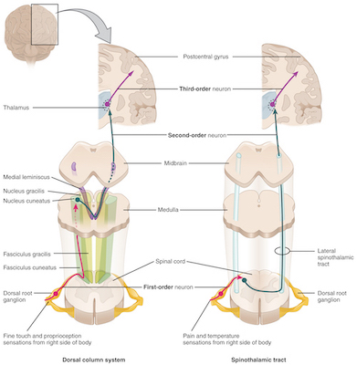
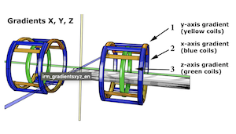
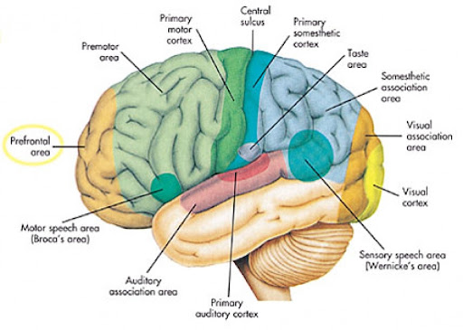
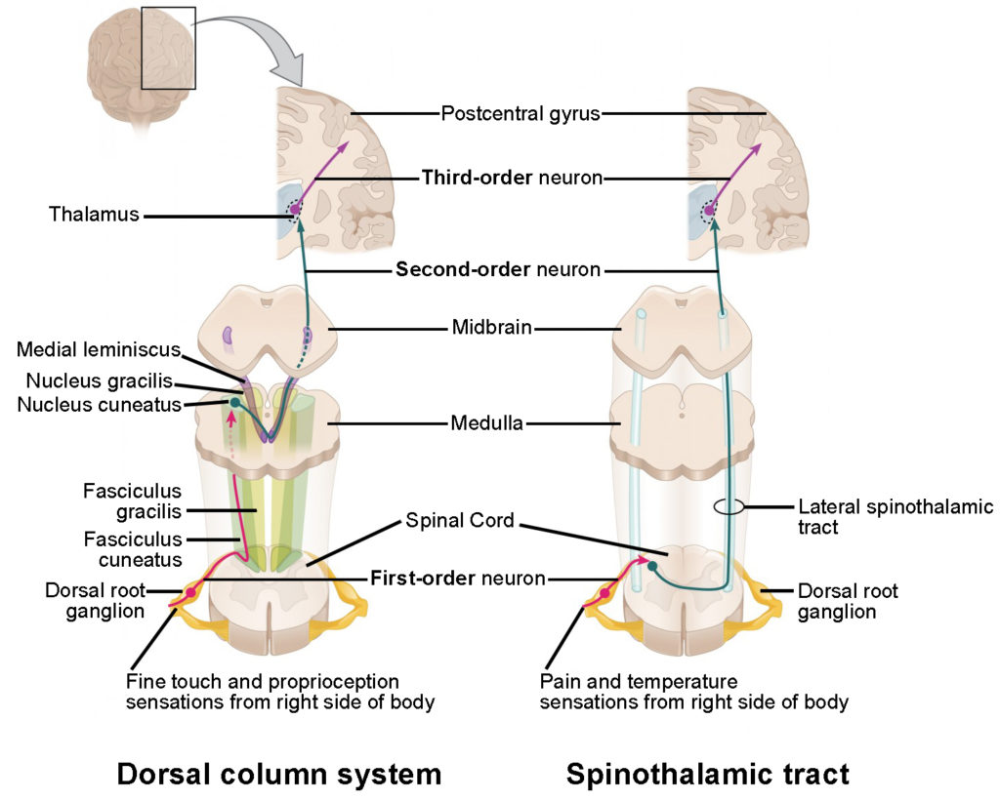

# MRI in neuroscience 
## Lecture 1 - Fundamentals of MRI
- 13 lectures in the course
- exam at the end (multiple choice, online) - around February
- Intro:
	- MRI involves a lot of different things - structural, functional connections, but also vascularity and anatomy
	- Bloch and Purcell - 1940s - discovery of MRI
	- magnetic relaxation times of tissues is different
	- other techniques developed: 2d Fourier transform imaging, echo planar imaging, whole-body MRI scanners
	- fundamentals of MRI are not complicated (unlike the physics)
- Spin and precession:
- 
	- a lot of bodies are composed of water ($H_2O$)
	- the hydrogen atom has a proton and an electron
		- important property - **spin** (a property like charge or mass)
		- the spin causes the particle to behave like a magnet (dipole)
		- particles also produce a magnetic field around them
		- any nucleus with an odd number of protons can be used for MRI
	- **precession** is different from spin
		- it's a rotation around the axis of a strong magnetic field
		- the external magnetic field exerts torque on the proton
	- protons *spin around their own axis* and also *precess around the axis of the magnetic field*
	- protons *precess* at a different frequency
		- depends on the nature of the nucleus and the strength of the magnetic field
		- **Larmor frequency** of the atom is the frequency is precesses at
	- the precession has a different phase at any given moment
- In a magnetic field:
- 
	- in a tissue, we would have a bunch of hydrogen atoms with different orientations
		- in a weak magnetic fields, the orientations are random and their sum is 0 (since they're random)
		- in a strong static magnetic field ($B_0$ or $B_o$), the magnetization of the protons will align with the field (low energy state) or in the opposite direction (high energy state)
		- there are more protons in the low energy state, so the net magnetization will point in the direction of the magnetic field
		- the protons are *not* precessing synchronously, they are out of phase
	- in MRI, **the spin excess** is used to generate the image (the protons that don't cancel each other out)
		- at 3T, only about 10 protons per million constitute the excess (but there are billions of protons, so it's not that few)
		- amount depends on temperature and field strength
		- "spin" can be used as a synonym for a proton or nucleus
	- changing the magnetic field is done by applying a radio frequency pulse, which induces a magnetic field change ($B_1$)
		- if it is applied at the **Larmor frequency**:
			- there is a transfer of energy from the pulse to the protons (only happens if the pulse is at a specific frequency)
			- *the magnetization will flip into the transverse plane* - from $\uparrow$ to $\rightarrow$
			- *protons will start spinning **in phase** *
			- the strength of the pulse determines how much the magnetization is flipped
				- the angle is called the **flip angle**
- then, when the radio frequency pulse is turned off, the protons still stay in their flipped orientation, but they slowly start to precess out of sync 
	- **T2 relaxation** - de-phasing of protons/spins (time to fall off to 37% of its original value)
	- T2 is known as **transverse/spin-spin** relaxation - happens due to proton-proton interactions
	- happens *very* fast
	- if you wait even longer, the magnetization will return back to its original orientation from $\rightarrow$ to $\uparrow$
	- **T1 relaxation** - return to $B_0$ (time to return to 63% of the maximum value)
	- T1 is known as **spin-lattice/longitudinal**
	- the two types of relaxations happen at the same time, but the first one is much faster
- T1 and T2 times are different for different tissues - e.g. for lung vs liver
- structural scans rely on T1 relaxation - T1-weighted images have better contrast than T2
- 
- T2\* relaxation
	- if the magnetic field was completely homogeneous, we would only have T2 relaxation
	- T2\* is due to the effects of the inhomogeneities in the magnetic field - T2\* happens even faster
- How is MRI signal measured?
	- a loop of wire (coil) measures a moving magnetic field
	- this only works in the **transverse** plane
		- any changes in the longitudinal plane will be overwhelmed by the scanner magnetic field!
- How are signals described?
	- low signal - **hypointensity** - black
	- high signal - **hyperintensity** - white
- Hardware of a scanner
	- 
	- the **magnet** is cooled with liquid helium to a superconducting temperature
	-  the **RF coil** - radio frequency coil - this produces the excitation of the protons
		- some also receive the signals
	- **the gradient coil** - localizes the signal in the sample
	- typical strengths: 1.5 T, 3 T, 7 T - for human use (could go up higher)
		- this refers to the strength of the magnet that produces the $B_0$ field
	- the whole scanner is usually placed in a Faraday cage to limit interference from electronic devices
	- a computer translates the data from binary to images
	- PACS - picture archiving clinical system
	
## Lecture 2 - Introduction to Neuroanatomy I
- embryology - development of the organism from two cells
- 
- the blastula (early organism) has three layers
	- top is the animal pole (fast dividing, contains ectoderm - skin/CNS, mesoderm - muscle/bone/CVS, endoderm - digestive tract/lungs)
- ectoderm forms the neural plate, from which neural folds rise and form the neural tube
  - 
  - inside of the neural tube has the neural canal
  - the neural tube forms the spinal cord
  - neural crest on top of the neural tube forms the sensory and the sympathetic nervous system
  - the neural tube consists of neuroepithelial cells that start differentiating when the neuropores close
- multipotent neural crest progenitor gives rise to sensory neurons, autonomic neurons, schwann cells (glial cells), pigment cells, smooth muscle
- after 2 months of embryonal development:
	- the spine is now formed and has the intermediate, dorsal and ventral horns (gray matter), also the white matter and the dorsal root
	- 
	- we share a regionalized spine with other mammals: cervical, thoracic, lumbar, sacral and coccygeal + cauda equina at the end (horse's tail)
	- the white matter is only present at the cervical and thoracic ends (no more myelin later, only nerves floating in CSF - that's why we can do CSF biopsies easily)
	- each segment of the spinal cord has two pairs of nerves
- the brain will be a segmented tube:
  - 
  - telencephalon (cerebrum)
  - diencephalon (thalamus, hypothalamus, optic nerves)
  - mesenchephalon (midbrain)
  - metencephalon (pons)
  - myelencephalon (medulla)
- the cerebral vesicles enlarge, differentiate and fold, at 1.5 months the cranial nerves will be present with the nuclei
- past 2 months, the basic structures have developed
- the pituitary gland (hormonal center) develops partly from the brain and partly from the areas outside the brain, such as the mouth
- medical examples:
	- neuropores:
		- spina bifida (spine malformation) - bottom neuropores don't close
		- anencephalia (no brain) - top neuropores don't close
	- if the two hemispheres don't separate:
		- holoprosencephaly 
- Monro-Kellie hypothesis: pressure-volume dynamic equilibrium among brain tissue/CSF/blood
	- the CNS is closed inside the spine and the skull
- spinal cord
  - 
  - the spinal cord is enclosed and protected by the spine
  - the anatomy is harder to tell apart in an MRI
  - gray/white matter:
    - in the spinal cord, the gray matter is on the inside (root) and the white matter is outside (coating)
    - in the brain, the gray matter is on top and the white matter is inside
  - in MRI it's hard to tell the difference between the gray and white matter in the spinal cord
  - why are there regional differences in the amount of grey and white matter?
    - more motor functions - more gray matter
  - the "butterfly" has the posterior horn (sensory), intermediate zone(inhibitory), lateral horn (autonomous nervous system), anterior horn (motor)
    - medial lemniscal (dorsal column) and anterolateral (spinothalamic) - sensory
    - lateral (corticospinal) and medial (corticospinal) - motor
  - dermatome - innervated by afferent nerve fibers from a single dorsal root of a spinal nerve
  - myotome - group of muscles innervated by a single spinal nerve
- pathways from the brain:
  - 
  - pyramidal tract - descending pathway - motor control (from the motor cortex to the midbrain to pons to the lateral corticospinal tract) - crosses at the pons/medulla
- to the brain
  - 
  - medial lemniscal - ascending pathway - from primary sensory neurons to medulla (crosses) then to the thalamus and sensory cortex
  - anterolateral tract - ascending pathways - other sensory neurons e.g. pain (cross at a different level)

## Lecture 3 - Fundamentals of MRI Part 2
- recap:
	- protons have spin and act like tiny magnets
	- they precess at a certain frequency (Larmor) and have a phase
	- putting them in a strong magnetic field $B_0$ causes them to **align** with or against the axis of the field (mostly with)
	- applying a radiowave $B_1$ at the Larmor frequency flips the magnetization and causes protons (spins) to **precess in phase**
	- removing $B_1$ leads to **de-phasing** (**T2** relaxation) and return to longtitudinal plane (**T1** relaxation)
	- relaxations occur at the same time, but T2 is faster
	- the signal is recorded by a loop of wire in the transverse plane
	- an MRI scanner has a magnet, coil and receiver
- MRI coordinate system:
  - 
  - *z* - slice direction, pointing "up" through the body
  - *x* - frequency encoding direction
  - *y* - phase encoding direction
- an MR sequence is a series of events leading up to an image
	- contains an RF excitation pulse, spatial encoding gradients and a signal readout (echo)
	- optional elements: contrast modification, speed modification, artifact reduction
- a sequence has all these elements happen across time
  - 
  - the RF pulse comes with a flip angle (how much energy it has and passes onto the proton)
  - slice selection gradient
  - phase and frequency encoding gradients
  - RF => slice => phase encoding => freq encoding => **signal**
- times in a sequence:
	- **echo time**: from RF to signal
	- **repetition time**: from one RF to next RF
- basic types of MR sequences:
  - 
  - **gradient echo**
    - RF pulse ($< 90^o$)
    - very fast
    - T2\* weighted (sensitive to magnetic field inhomogeneity)
    - can also be T1-weighted
  - **spin echo**
    - $180^o$ pulse after initial $90^o$ pulse ("refocusing")
    - T2-weighted (insensitive to inhomogeneities)
    - can also be T1 weighted
    - but takes longer, more RF 
- refocusing:
	- re-phases the protons
	- parallel to magnetic field (longitudinal plane) => 90 pulse, then 180 to move it to the horizontal axis pointing the other way (in the transverse plane)
	- this removes the effect of inhomogeneities
- how is the signal turned into MR images?
	- analog signal (RF waves) -> digitized signal -> data matrix (K-space)
	- inverse Fourier transform -> image
- MR image:
	- MR images are composed of pixels (voxels)
	- the entire image is called the FOV (field of view)
- how does the scanner localize signals?
  - $B_0$ runs parallel to the body
  - 
  - **slice selection gradient** - the magnetic field is slightly varied over z (from + to 0 to -)
  	- Larmor frequency is dependent on the strength of the field and the element that the proton is of
  	- changing the magnetic field changes the Larmor frequency
  	- in the middle of this gradient, the protons will precess at the RF pulse frequency (*this middle section selects the slice*)
  - **phase encoding gradient** varies the magnetic field along the y axis - at this point, all protons are precessing in phase and this gradient adds a variation in phase
  - **frequency encoding gradient** varies the magnetic field over the x axis - this is applied during the readout of the signal and causes some protons to spin faster
- image contrast
	- hyperintensity (white) -> hypointensity (black)
	- signal intensifies differently between tissues
	- MRI can produce many different contrasts unlike a CT
	- contrast depends on:
		-  the density of mobile protons (protons in fat and water)
		- T1 characteristics (shape of the relaxation curve) 
		- T2 characteristics
- TR (repetition time) and TE (echo time) are used to control the contrast 
	- short TR, short TE - T1-weighted (determined by T1 properties)
	- long TR, short TE - PD-W (lots of signal, little contrast - measuring the amount of protons)
	- long TR, long TE - T2-weighted (determined by T2 properties)
	- even longer TR and TE - FLAIR (sensitive to abnormalities)
	- which properties determine the image depends on which curves (T1 or T2) for different tissues are further from each other
	- http://xrayphysics.com/contrast.html

## Lecture 4 - Introduction to Neuroanatomy II

- after the neuropores (openings in neural tube) close, the neural tube starts growing "bubbles" at around the 4th week of gestation - these are the cerebral vesicles 

  - cavities inside the vesicles creates the ventricles
- CNS developers from caudal to cranial (e.g. from medulla/pons to cerebrum)
- the telencephalon makes up about 85% of the total weight of the brain
- brainstem
- 

  - elongation of the spinal cord
  - spinal cord => pyramidal decussation (fibers crossing) => medulla oblongata => pons
  - 12 cranial nerves and 15 nuclei 
    - olfactory (olfactory bulb), optical (thalamus), oculomotor, trochlear (mesencephalon), trigeminal, abducens, facial, vestibulocochlear (pons), glossopharyngeal, vagus, accessory, hypoglossal (medulla)
    - some nerves contribute fibers and nuclei to others 
  - long tracts: corticospinal, corticobulbar, medial lemniscal, spinothalamic (motor and sensory information)
  - cerebellum 
  - 
    - input: cerebral cortex, vestibular system, ascending pathways (plans for movement, proprioception)
    - output: cranial nerve nuclei, red nucelus, reticular formation, hypothalamus, cerebral cortex (influence descending pathways)
    - this input goes into cortex cerebellaris (gray matter has Purkinje cells that do the computing)
    - cerebellar pathways are double-crossed (nerves switch sides twice)
    - types of tasks: processing for limbs (hemispheres), balance and eye movements (flocculonodular node), trunk movement (vermis) (alcohol disproportionately produces atrophy in the vermis)
  - reticular formation: ARAS (ascending reticular activating system) - attention and alertness, also includes primitive reflexes (breathing, vomiting)
  - we can't see nuclei in MRI, but can see some nerves
- mesencephalon
- 

  - basal ganglia
  - substantia nigra - Parkinson's disease
  - tectum - colliculi (superior and inferior), reflexes
  - tegmentum - cranial nerve nuclei, red nuclei
- diencephalon
- 

  - 3rd ventricle 
  - thalamus (2 thalami take up the most space)
    - relay nucleus consisting of multiple sensory nuclei (medial geniculate - hearing, lateral geniculate - vision)
    - also includes cerebellum and basal ganglia information 
  - hypothalamus
    - metabolism and homeostasis
    - secretes vasopressin and oxytocin (released into blood)
    - also secretes a hormone only into the portal blood system (activates the pituitary)
      - TRH, GHRH, GnRH, CRH, DA (modulates lactation) - then pituitary secretes them into the bloodstream 
  - pituitary gland
  - subthalamus 
  - epithalamus (circadian rhythm)
- telencephalon
- 

  - frontal lobe (central sulcus)
  - temporal lobe (sylvian fissue)
  - parietal lobe (parietal-occipital sulcus)
  - occipital lobe
  - cortices: primary, association, higher order cortices, also limbic system
  - language
    - wernicke's area - speech perception
    - broca's area - speech production
    - dominant hemisphere hosts speech
- motor pathway:
- 

  - conscious movement: 
    - lateral corticospinal tract
    - anterior corticospinal tract
  - 
  - conscious sensation:
    - dorsal column / medial lemniscal
    - anterolateral system / spinothalamic tract
    - spinocerebellar tract
- vision system
- 

  - overlapping visual fields from two eyes
  - some of the fibers (nasal) cross at the optic chasm 
  - projects to lateral geniculate bodies => V1
- hearing
- 

  - cochlear nerve => cochlear nuclei => inferior colliculi 
  - hearing is much more ipsilateral
- olfaction
- 

  - olfactory neurons/receptors in the nose synapse in the sensory bulb => primary olfactory cortex (periform cortex)
  - synapse to the amygdala, uncus and parahippocampal gyrus
  - do not go through the thalamus
- limbic system
- 

  - cingulate sulcus, cingulate gyrus, rhinal sulcus, parahippocampal gyrus, collateral sulcus, temporal pole
  - behavior/emotions/memory
- basal ganglia
- 
  - also spans telencephalon and diencephalon
  - nucleus caudaus, globus pallidus, amygdala, putamen etc
  - motor programs
- medical examples

  - damage to the ventral pons - both sensory and motor systems are affected
  - right hand and face numbness - could be primary sensory or trigeminal+other nerves damage, but probably thalamus (stroke)
- treatment window for stroke

  - 4 hours (can be treated with thrombolitic drugs)
  - recanalization - taking out the clot 

## Lecture 5 - MRI in clinical neurology, Part I

- radiological diagnostic tools:
  - radiograph (X-ray) - involves ionizing radiation and has limited diagnostic quality
  - ultrasound - uses sound waves reflected off tissues (harmless) but is very rater dependent
  - CT - uses combinations of multiple x-rays to get slices (also heavy on radiation)
  - MRI - uses a magnetic field to excite protons in atoms in different tissues (also gradients and radio waves)
  - angiography - fluoroscopic (X-ray beam passage) technique
- MRI pros and cons:
  - high contrast between tissues and structures
  - good resolution
  - no ionizing radiation
  - versatile
  - but: long acquisition time, susceptible to motion artifacts, expensive, contraindications 
- MRI achieves tissue differentiation by combining information from several sequences
  - T1-W: from black to white - air/blood - collagenous tissue/water tissues - protein tissues - fatty tissue/blood products
  - T2-W: air/blood - collagenous tissue/water tissues - fat - high free water tissue/blood products
- MRI has various applications, e.g. static (T1, T2, FLAIR), dynamic (perfusion/cardiac imaging), functional (BOLD fMRI, DWI)
- planning an MRI exam: clinical info (what am I looking for), which sequences do I need to do, previous images
- important: *MRI has switched directions, e.g. right of the picture is the left hemisphere and vice versa*

## Lecture 6 - MRI in clinical neurology, Part II

- approach to diagnosis in neurology
  - localization and characterization (nature of the pathology)
  - clinical circumstances also help with diagnosis
- different medical imaging techniques exist:
  - tomorgraphic: CT, MRI, PET, SPECT
  - ephys
  - fluoroscopy and radiohgraphy
  - ultrasound
- tomographic views:
  - sagital (side view, perpendicular to face)
  - coronal (plane of the fact)
  - axial (looking from above/below down)
- structure and function distinction
  - e.g. CT is mostly concerned with structure, but can also give functional information
  - MRI can do both
  - PET is great at activity
- Types of MRI:

- types of contrast:
  - T1: water is dark, T2: water is light
  - T2 is best for pathologies, since they are often associated with edemas
  - FLAIR: T2 weighted, but flowing fluid (e.g. CSF is suppressed), so it's better at picking up pathology close to CSF spaces
    - inversion recovery: takes longer to do
  - T2* weighted imaging: arises from magnetic field inhomogeneities, hematomas/hemorrages become hypointense (dark)
  - Susceptibility weighted imaging (SWI): same purpose as T2*, but more sensitive to blood products (combines magnitude and phase information)
    - diamagnetic (has an effect in the opposite direction of the field, most body substances)
    - paramagnetic (has an effect in the same direction as the field, deoxyhemoglobin and others)
    - ferromagnetic (strongly magnetizable, e.g. iron etc)
  - Proton density weighted imaging: most dense tissues are brightest
  - Diffusion weighted imaging: uses diffusion of water molecules to generate contrast (movement of water is different in different tissues, this is particularly helpful to visualize axons)
  - Angiography: visualizing blood vessels
    - Time-of-flight: stationary tissue is saturated by multiple RF pulses, but flowing blood is not (so contrast is not even always necessary)
    - phase contrast: a bipolar gradient is applied and stationary vs moving spins are affected differently
  - contrast enhancement: usually IV, contains gadolinium (paramagnetic = shortens T1 and T2*)
  - fat suppression: used to better see contrast enhancement and to see if something is a fatty tissue or not (fat has a very short T1 and a different resonance frequency to water)
- clinical MRI scanners:
  - 1.5 - 3 T (newer ones: 7 T)
- MRI safety:
  - no ferromagnetic metal in/on the body or in the room
  - magnetic field and radiowaves affect electrical devices
  - gradients lead to audible noise
  - contrast agents can cause allergies or kidney disease with repeated use
- use cases:
  - vascular diseases (stroke etc)
  - demyelination (visible with FLAIR or T1+contrast)
  - infection
  - degeneration (dementia, AD)
  - neoplasms (tumors etc)
  - metabolic/toxic diseases

## Lecture 7 - MRI preprocessing

- processing MRI data is not trivial
  - decisions made while processing affect the results
- considerations:
  - what needs to be done - i.e. make image smoother
  - how to do it - which parameters, methods
  - why does this need to be done - every step has pros and cons
  - when does the step occur - the order might affect the results too
- tools: FSL, AFNI, FreeSurfer, ANTs
- data format:
  - DICOMs
    - can be stored in large systems - PACS
  - but most processing software uses NIfTI (or Analyze)
  - most MRI data consists of the image data (gray values for voxels) and a header (data description)
- intensity non-uniformity correction
  - signal can vary smoothly across the image
  - can be due inhomogeneous RF excitation, receiver coil sensitivity or interaction between the magnetic field and the conductive material
  - correction can be prospective or retrospective (filtering, clustering, Fourier transform)
- geometric distortion correction
  - occurs due to B0 inhomogeneity at tissue interfaces
  - especially with echoplanar imaging (fast method)
  - can be corrected with a field map
- signal can "drop out" due to inhomogeneities, but this cannot be corrected
- slice timing correction
  - compensates for differences between slice acquisition times
- brain extraction
  - skull stripping - removes non-brain tissue (is also necessary for steps like registration, segmentation)
  - starts from a seed in the middle until edges occur
- segmentation
  - tissues
    - can be used to separate the brain into tissues (e.g. gray matter, white matter, csf)
    - can be done using peaks in the signal intensity graph
  - anatomical
    - done using standard atlases of regions
  - caveats for segmentation:
    - signal inhomogeneities can affect it
    - partial volume effects
- registration
  - different images are in different spaces (even in the same subject!)
  - images can be moved to match other images (alignment)
  - considerations: how to move the image and how much
  - used for group analysis, longitudinal analysis, using labels/atlases
  - types of registration:
    - same subject, same modality - linear transformations (xyz displacement, xyz rotation - 6 DOF) 
    - this assumes that brain shape and size don't change
    - same subject, different modality - linear transformation (displacement, rotation, affine (big/small) 12 DOF) 
    - accounts for different sequence properties
    - different subjects - normalization (e.g. aligning to template)
      - non-linear (millions of DOF)
      - cost function - how to assess similarity of images
      - resampling - change voxel values
- motion correction
  - it's hard to stay still in the scanner
  - static anatomical images - not much of an issue
  - is an issue in functional MRI (since it has a time component)
  - particularly an issue in ill patients, elderly, claustrophobic, children
  - motion can be quantified in many ways, e.g. framewise displacement
  - primary correction - alignment between slices
  - secondary motion correction - removing the effect of motion on the signal itself - much harder!
    - regression
    - despiking
    - scrubbing
    - decomposition
  - prospective motion correction
    - tracking - e.g. using head markers or navigator scans (adjusts image in real time)
    - prevention is best - explain to subjects, use padding, minimize scan times
- spatial smoothing
  - removes high frequency information
  - increases SNR
  - required for some analyses
  - method: convolve with a Gaussian kernel (specificed FWHM/SD)
  - balancing act: need to remove just enough noise
- temporal filtering
  - can be done to remove faster changes
  - underlying signals that drive fMRI are quite slow
- general advice
  - avoid point-and-click pipelines
  - draw a schematic diagram of the pipeline
  - optimize pipeline on an independent dataset
  - always look at images at every step, make sure expected stuff is happening

